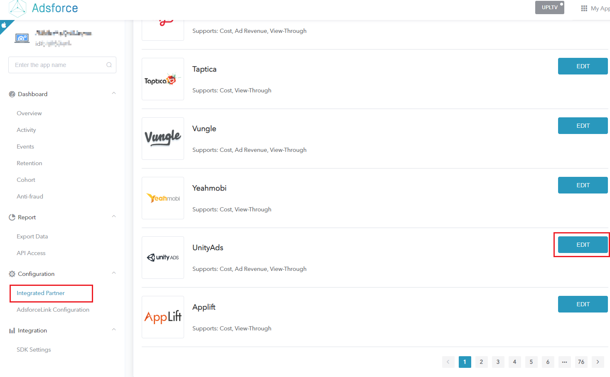
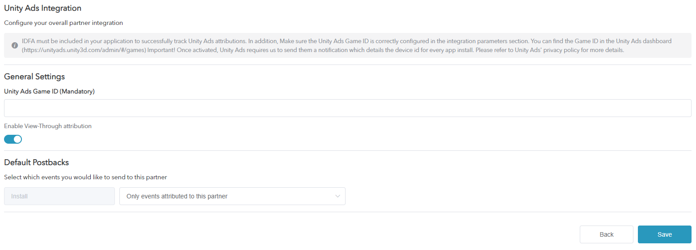
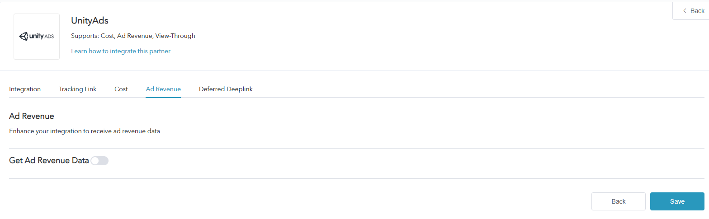

# How to Configure a Campaign with UnityAds

* UnityAds is one of Adsforce's integrated partners, providing advertisers with video promotion for iOS and Android;

* In addition to click-based performance analytics, UnityAds also supports other types of performance analytics such as cost, ad revenue, and view-through.

## UnityAds Integration

To configure your campaigns with UnityAds, follow the steps below.

### Set Up UnityAds

  1. [Login Adsforce](https://demo-portal.adsforce.io/login);

  2. Click your App under "My Apps";

     

  3. Under "Configuration" > "Integrated Partner ", search "UnityAds" and click "EDIT";

     

  5. Go to **UnityAds'** configuration window.

UnityAds' configuration window includes 5 options: `Integration`, `Tracking Link`, `Cost`, `Ad Revenue` and `Deferred Deeplink`.

### UnityAds Integration

> **[info] Important**
> 
> * You can get **Performance Analytics Data** after integration;
> * Track UnityAds performance analytics successfully only if IDFA is included in your App;
> * Make sure the UnityAds game ID is properly configured in integration parameters;
> * Get game ID in [UnityAds Dashboard](https://unityads.unity3d.com/admin/#/games)；
> * Once activated,  a notification will be sent to UnityAds detailing each App ID;
> * For further information, refer to UnityAds' Privacy Policy.

 

#### UnityAds Game ID

* Adsforce is connected to UnityAds via UnityAds Game ID;
* **UnityAds Game ID** is available from UnityAds.

You can get Game ID via "Acquire" > "Campaigns" in [UnityAds Dashboard](https://unityads.unity3d.com/admin/#/games) .

#### Enable View-Through Performance Analytics

Toggle this to **ON** if you want to analyze view-through installs from UnityAds. 

#### Default Postbacks

* Select `Only event attributed to this partner` for events coming **only** from users attributed to UnityAds;
* Select `Event attributed to any partner or oranganic` to have your **entire** user base available to be reported to UnityAds.

### Tracking Link

* All parameters added in this page will only generate a **tracking link**;

* This tracking link is only available for UnityAds；

* You can in-depth analyze your product using the tracking link.

 

#### Tracking Link Parameters

* The added parameters will be displayed in the **Tracking link** below;
* You can in-depth analyze your product through adding parameters here;
* Adding and deleting parameters here can redefine the parameters added on the tracking link.

#### Click-Through Performance Analytics

* Configurable click performance analytics lookback window allows you to customize the performance analytics period from **click to app install**;
* Customizable settings 1~23 hours or 1~30 days;
* The time or date set here will appear in the tracking link below.

#### Click Tracking Link

* The link here shows all the setting information;
* The click tracking link will be copied to link to UnityAds.

#### Impression Performance Analytics

* Configurable impression performance analytics lookback window allows you to customize the performance analytics period from **impression to app install**;
* Customizable settings 1~23 hours or 1~30 days;
* The time or date set here will be appeared in the tracking link below.

#### Impression Tracking Link

* The link here shows all the setting information;

* The tracking link will be copied to UnityAds.

 

### Cost Configuration

* Your UnityAds cost data can be enhanced through cost integration;

* Make sure you have got UnityAds API Key before enabling UnityAds cost data.

 

#### Get Cost Data

To get UnityAds cost data, you need to turn on **Get Cost Data**.

#### API Key

* API Key is used to verify the API in **Cost Report**;

* The updated data window will take effect until saved.

 

#### Organization ID

* You can get the organization ID in **cost report**;

* The updated data window will take effect until saved.

 

### Ad Revenue

* Ad revenue data can be received from UnityAds through Ad revenue integration;

* Make sure you have got GAME ID and API Key before enabling UnityAds advertise revenue.

 

#### Get Ad Revenue Data

Here you can set performance analytics for Ad revenue data.

To get UnityAds Ad revenue data, you need to turn on **Get Ad Revenue Data**.

#### GAME ID

* You can get GAME ID from UnityAds (see “UnityAds Game ID” in "UnityAds Game ID" above for details);
* GAME ID is used to validate revenue in **Advertising Revenue**;
* The updated data window will take effect until saved.

#### Enter API Key

