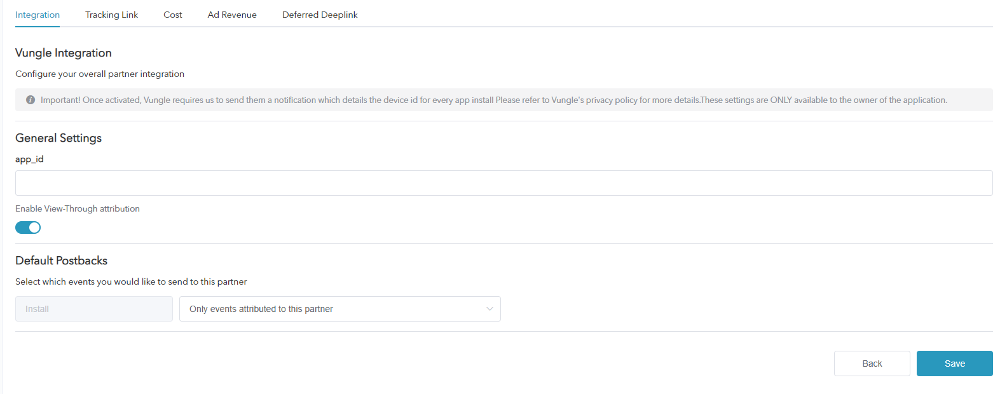
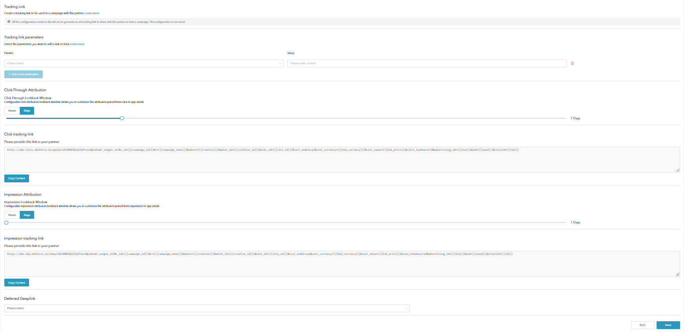
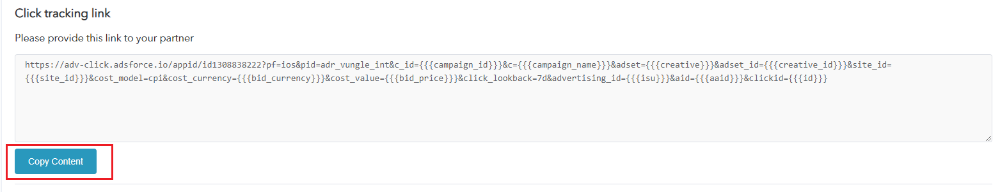
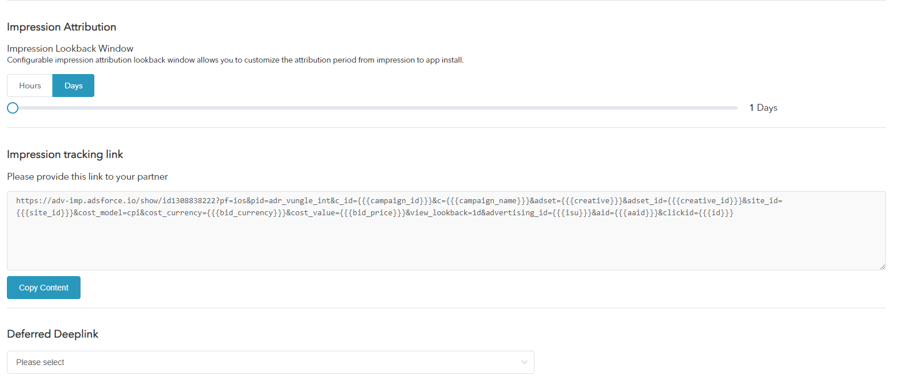

# How to Configure a Campaign with Vungle

* Vungle, one of Adsforce's integrated partners, is a leading provider of video ads for advertisers;

* In addition to click-based performance analysis, Vungle also supports other types of performance analysis such as cost, ad revenue, and view-through .

## Vungle Integration

To configure your campaigns with Vungle, follow the steps below.

### Set Up Vungle

###### 1. [Login Adsforce](https://demo-portal.adsforce.io/login);

###### 2. Click your App under "My Apps";

###### 3. Under "Configuration" > "Integrated Partner ", search "Vungle" and click "EDIT";

 

Vungle's configuration window includes 5 options: `Integration`, `Tracking Link`, `Cost`, `Ad Revenue` and `Deferred Deeplink`.

### Vungle Integration

> **[info] Important**
>
> You can get **Performance Analytics Data** after integration.

To start integration of Vungle campaigns with Adsforce, follow these steps:

######1. Enter Link ID

&ensp;&ensp;&ensp;1) Adsforce is connected to Vungle via App ID;

&ensp;&ensp;&ensp;2) [App ID](app-id/README.md) is available from Vungle.

######2. Enable View-Through Performance Analytics

&ensp;&ensp;&ensp;Toggle this to **ON** if you want to analyze view-through installs from Vungle. 

######3. Default Postbacks

* Select `Only event attributed to this partner` for events coming **only** from users attributed to Vungle;
* Select `Event attributed to any partner or oranganic` to have your **entire** user base available to be reported to Vungle.

### **Tracking Link**
> **[info] Important**
>
> * All parameters added in this page will only generate a **tracking link**;
> * This tracking link is only available for Vungle;
> * You can more in-depth analyze your product using the tracking link.

### Tracking Link Parameters

* The added parameters will be displayed in the **Tracking link** below;

* You can in-depth analyze your product through adding parameters here;

* Adding and deleting parameters here can redefine the parameters added on the tracking link.

#### Click-Through Performance Analytics

* Configurable click performance analytics lookback window allows you to customize the performance analytics period from click to app install;

* Customizable settings 1~23 hours or 1~30 days;

* The time or date set here will appear in the tracking link below.

#### Click Tracking Link

* The link here shows all the setting information;
* The click tracking link will be copied to link to Vungle.

######&ensp;&ensp;&ensp;&ensp;1. Click **Copy Content**;

######&ensp;&ensp;&ensp;&ensp;2. Send the copied link to **Vungle** > **Tracking** > **Click URL**.

#### Impression Performance Analytics

* Configurable impression performance analytics lookback window allows you to customize the performance analytics period from impression to app install;
* Customizable settings 1~23 hours or 1~30 days;
* The time or date set here will be appeared in the tracking link below.

#### Impression Tracking Link

The link here shows all the setting information.

######&ensp;&ensp;&ensp;&ensp;1. In Adsforce Dashboard > **Integrated Partner** > Vungle's **Impression Tracking Link**, click **Copy Content**;

######&ensp;&ensp;&ensp;&ensp;2. Send the copied link to Vungle Dashboard > **Tracking** > **Impression & Events** to **activate** ad users viewing the same type of App.

&ensp;&ensp;&ensp;&ensp;&ensp;&ensp;1）“Event” - Select the valid condition from the dropdown lists;

&ensp;&ensp;&ensp;&ensp;&ensp;&ensp;2）Event Tracking URL - Paste the copied impression tracking link in **Enter URL**;

&ensp;&ensp;&ensp;&ensp;&ensp;&ensp;3）Click **Add Event**;

&ensp;&ensp;&ensp;&ensp;&ensp;&ensp;4）Add Events & Trackers - The link is added successfully if a prompt displays.

### **Cost Configuration**

> **[info] Important**
>
> * Your Vungle cost data can be enhanced through cost integration;
> 
> * Please make sure you have got [Vungle API_Key](api-key/README.md) before enabling Vungle cost data.

#### **Get Cost Data**

To get Vungle cost data, you need to turn on **Get Cost Data**.

#### API Key

* [API Key](api-key/README.md) is used to verify the API in **Cost Report**;

* The updated data window will take effect until saved.

### **Ad Revenue**

> **[info] Important**
>
> * Ad revenue data can be received from Vungle through Ad revenue integration;
> 
> * Please make sure you have got Secret Key and App ID before enabling Vungle advertise revenue.

 

#### Get Ad Revenue Data

Here you can set performance analysis for Ad revenue data.

To get Vungle Ad revenue data, you need to turn on **Get Ad Revenue Data**.

#### Secret Key

* You can get Secret Key by checking Key in the account page to verify the API in the **Ad Revenue Report**;

* You need to ask Vungle AM for Secret Key.

#### **App ID**

Enter [App ID](app-id/README.md) in the Vungle account.

