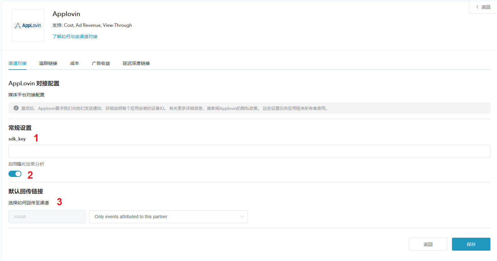
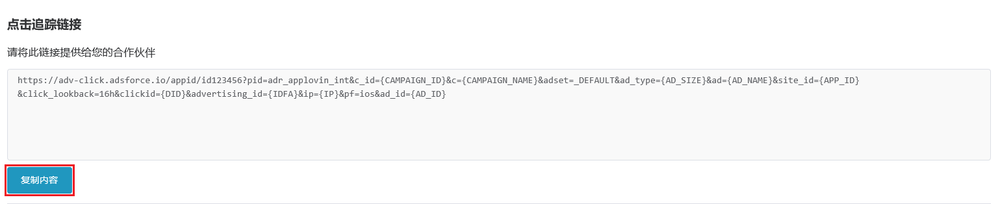
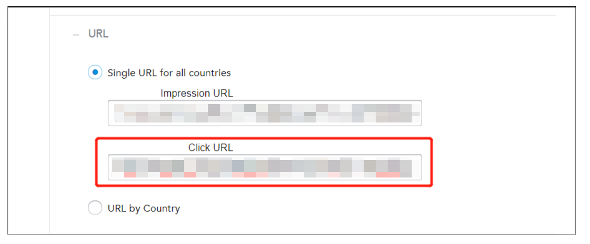

# Applovin 追踪配置

## 概述

* Applovin 是 Adsforce 的集成合作伙伴之一，为广告主提供精确的目标用户和用户习惯；

* 除点击效果分析外，Applovin 还提供成本、广告收益和曝光效果分析。

## Applovin 追踪配置

如需配置 Applovin 请按以下步骤操作：

### 打开 Applovin 配置窗口

###### 1. [登录 Adsforce 应用](<https://demo-portal.adsforce.io/login>)；

###### 2. 在“我的应用”列表项下，单击并选择需配置的应用程序；

   

###### 3. 在“配置管理” > “媒体平台”配置页面，搜索 “Applovin” 并点击“编辑”；

 

###### 4. 进入 **Applovin** 配置窗口。

   

 Applovin 配置窗口包括 5 个选项：`渠道对接`、`追踪链接`、`成本`、`广告收益` 和 `延迟深度链接`

### 渠道对接

> **[info] 重要信息**
>
> 渠道对接完成后，便可获取**广告效果分析数据**。

 

#### SDK Key

-  Adsforce 是通过 sdk_key 与 Applovin 连接；
- SDK Key 需从 Applovin 中获取。

&ensp;&ensp;&ensp;&ensp;SDK Key 获取方法：

######&ensp;&ensp;&ensp;&ensp;1. [登录applovin](https://dash.applovin.com/login)；

######&ensp;&ensp;&ensp;&ensp;2. 在 “Account” 项目下，选择 “Keys” > “SDK Key”。

#### 启用曝光效果分析

如需属性为 Applovin 的曝光安装。请将此选项切换为 **ON**。

#### 默认回传链接

* 如**仅回传** Applovin 中的效果分析数据，请选择`Only event attributed to this partner`

* 如**回传所有**合作平台效果分析数据，请选择`Event attributed to any partner or oranganic`

### 追踪链接
> **[info] 重要信息**
>
> * 在此界面添加的所有参数只会生成一条**追踪链接**；

> * 此追踪链接仅适用于 Applovin；

> * 使用追踪链接可更深入的分析研究产品。

#### 追踪链接参数

* 添加的参数将会**在下方**追踪链接中显示；

* 在此添加参数可深入研究分析；

* 此处增删参数均可重新定义跟踪链接上已添加的参数。

#### 点击效果分析

* 此滑块允许自定义设置**点击到安装**的时间；

* 可自定义设置 1~23 小时或 1~30 天；

* 此处设置的时间或日期将会在下方追踪链接中显示。

#### 点击追踪链接

* 此处链接可显示设置的所有信息；

* 需复制点击追踪链接链接至 Applovin。

######&ensp;&ensp;&ensp;&ensp;1. 点击“复制内容”；

######&ensp;&ensp;&ensp;&ensp;2. 将复制的链接发送至 Applovin。

&ensp;&ensp;&ensp;&ensp;&ensp;&ensp;1）在 Campaign 中，点击某条 campaign；

&ensp;&ensp;&ensp;&ensp;&ensp;&ensp;2）点击右上角处 “Edit Campaign Targeting”，进入编辑 campaign 页面； 

&ensp;&ensp;&ensp;&ensp;&ensp;&ensp;3）点击左侧 “Edit Targeting” 项下的 URL，跳转定位至 URL 页面；

&ensp;&ensp;&ensp;&ensp;&ensp;&ensp;4）粘贴“点击追踪链接”。

#### 展示效果分析

* 此滑块允许自定义设置**展示到安装**的时间；

* 可自定义设置 1~23 小时或 1~30 天；

* 此处设置的时间或日期将会在下方追踪链接中显示。

#### 展示追踪链接

* 此处链接可显示设置的所有信息；

* 复制此链接可**激活**观看相同类型的广告用户。

######&ensp;&ensp;&ensp;&ensp;1. 点击“复制内容”；

######&ensp;&ensp;&ensp;&ensp;2. 将复制的链接发送到 Applovin。

&ensp;&ensp;&ensp;&ensp;&ensp;&ensp;1）在编辑 Campaign 页面，点击左侧 URL，跳转定位至URL项目； 

&ensp;&ensp;&ensp;&ensp;&ensp;&ensp;2）粘贴“展示追踪链接”。

 

### 成本

> **[info] 重要信息**
>
> * 通过成本对接，可优化您的 Applovin 推广成本数据。

> * 在启用 Applovin 启用成本数据之前，请确保已获取 Applovin API Key。

 

#### 获取成本数据

如需获取 Applovin 类成本数据，则需打开 “Applovin 成本数据”开关。

#### API key

* 广告主用于验证**成本报表**中的 API Key；

* 广告主需要向 Applovin 客服索要；

* 更新后的数据窗口将于保存后即刻生效。

### 广告收益

* 通过广告收益对接，可从 Applovin 获广告收益数据；

* 在启用 Applovin 广告收益之前，请确保已获取 Report Key 和 App Package Name。

 

#### 获取广告收益数据

此处可切换广告收益数据的效果分析设置。

如需获取 Applovin 类广告收益数据，则需打开“获取广告收益数据”开关。

#### Report Key

通过 “Applovin” > “Account” > “Keys” > “Report Key”，获取 Report Key，以验证**广告收益报表**中的 API。

> **[warning] 注意**
>
> 如查询页面中的 Key 为空，请发送邮件至 Applovin 进行查询。

#### App Package Name

通过 “Applovin” > “Monetize” > “Manage App” > “Basic Settings” > “Application Name”，查询并获取在 Applovin 应用**包名**。

