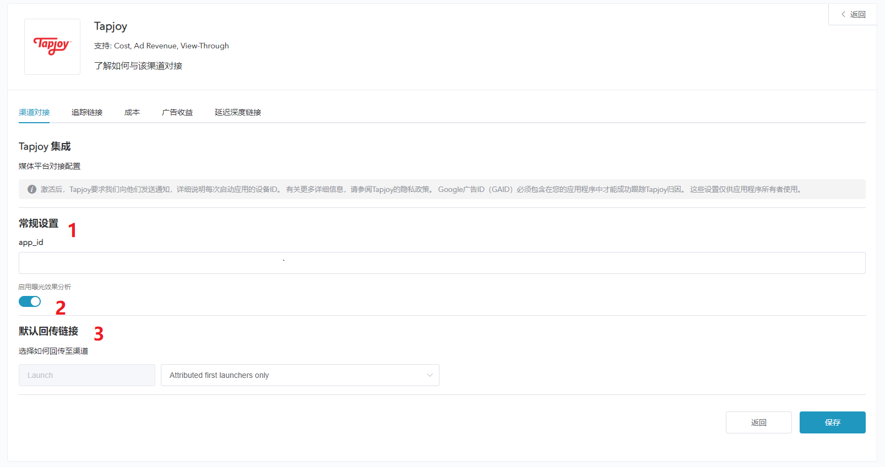
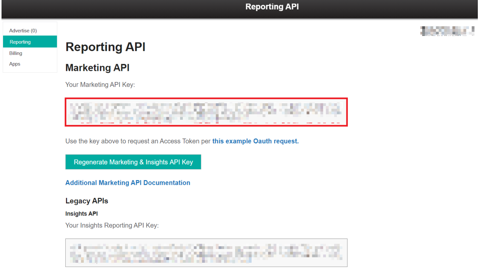

# **Tapjoy 追踪配置**

## 概述

* Tapjoy 是 Adsforce 的集成合作伙伴之一，为广告主提供广告服务、分析等功能；

* 除点击效果分析外，Tapjoy 还提供成本、广告收益和曝光效果分析。

## Tapjoy 追踪配置

如需配置 Tapjoy 请按以下步骤操作：

### 打开 Tapjoy 配置窗口

##### 1. [登录 Adsforce 应用](<https://demo-portal.adsforce.io/login>)；

##### 2. 在“我的应用”列表项下，单击并选择需配置的应用程序；

##### 3. 在“配置管理” > “媒体平台”配置页面，搜索 “Tapjoy” 并点击“编辑”；

##### 4.  进入 Tapjoy 配置窗口。

Tapjoy 配置窗口包括 5 个选项：`渠道对接`、`追踪链接`、`成本`、`广告收益` 和 `延迟深度链接`。

### 渠道对接

> **[info] 重要信息**
>
> 渠道对接完成后，便可获取**广告效果分析数据**。

#### 应用 ID

* Adsforce 是通过 应用 ID 与 Tapjoy 连接；
* 应用 ID 需从 Tapjoy 中获取。

获取应用 ID 方法如下：

######&ensp;&ensp;&ensp;&ensp;1. [登录Tapjoy](<https://ltv.tapjoy.com/s/l#session/login>)；
######&ensp;&ensp;&ensp;&ensp;2. 在 “Apps” 项目下，获取应用 ID。

#### 启用曝光效果分析

如需获取 Tapjoy 类曝光安装。请将此选项切换为 **ON**。

#### 默认回传链接

* 如**仅回传 ** Tapjoy 中的效果分析数据，请选择`Only event attributed to this partner`

* 如**回传所有**合作平台效果分析数据，请选择`Event attributed to any partner or oranganic`

### 追踪链接

* 在此界面添加的所有参数只会生成一条**追踪链接**；

* 此追踪链接仅适用于 Tapjoy；

* 使用追踪链接可更深入的分析研究产品。

#### 追踪链接参数

* 添加的参数将会**在下方**追踪连接中显示；

* 在此添加参数可深入研究分析产品；

* 此处增删参数均可重新定义在跟踪链接上已添加的参数。

#### 点击效果分析

* 此滑块允许自定义设置**点击到安装**的时间；

* 您可以自定义设置 1~23 小时或 1~30 天；

* 此处设置的时间或日期将会在下方追踪链接中显示。

#### 点击追踪链接

* 此处链接可显示设置的所有信息。

* 需复制点击追踪链接链接至 Tapjoy。

######&ensp;&ensp;&ensp;&ensp;1. 点击“复制内容”；

######&ensp;&ensp;&ensp;&ensp;2.  将复制的链接发送至 Tapjoy（粘贴追踪链接位置需向 Tapjoy 客服索要）。

#### 展示效果分析

* 此滑块允许自定义设置**展示到安装**的时间；

* 可自定义设置 1~23 小时或 1~30 天；

* 此处设置的时间或日期将会在下方追踪链接中显示。

#### 展示追踪链接

* 此处链接可显示设置的所有信息；

* 需复制展示追踪链接至 Tapjoy。 

######&ensp;&ensp;&ensp;&ensp;1. 点击“复制内容”；

######&ensp;&ensp;&ensp;&ensp;2. 将复制的链接发送至 Tapjoy（粘贴追踪链接位置需向 Tapjoy 客服索要）。      

### 成本

* 通过成本对接，可优化您的 Tapjoy 推广成本数据；

* 在启用 Tapjoy 启用成本数据之前，请确保已获取 Marketing API Key。

#### 获取成本数据

如需获取 Tapjoy 类成本数据，则需打开“获取成本数据”开关。

#### Marketing API key

* 广告主用于验证**成本报表**中的 API；
* 更新后的数据窗口将于保存后即刻生效。

可通过 “Tapjoy” > “Reporting” > “Marketing API” 查询账户页面获取 Marketing API key。

### 广告收益

* 通过广告收益对接，可从 Tapjoy 获广告收益数据。

* 在启用 Tapjoy 广告收益之前，请确保已获取 API Key 和 应用 ID。

#### 获取广告收益数据

此处可切换广告收益数据的效果分析设置。

如需获取 Tapjoy 类广告收益数据，则需打开“获取广告收益数据”开关。

#### API Key

通过 “Tapjoy” > “Reporting” > “Legacy APIs” 查询账户页面获取 API Key 以便验证**广告收益报表**中的 API。

> **[warning] 注意**
>
> * “Insights Reproting API Key”：用于获取单个广告；
> * “Legacy Reporting API Key”：用于获取账号下所有广告。

#### 应用 ID

在 Tapjoy 应用程序项下，查询应用 ID 并输入（获取方法详见本章“应用 ID” 节）。