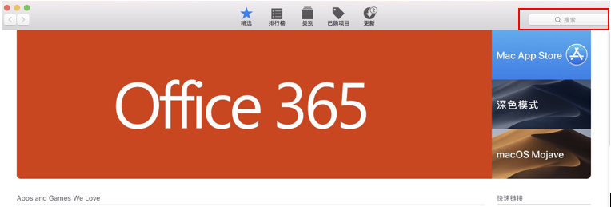

# 创建应用

> **[warning] 注意**
>
> 此功能仅对帐户管理员开放。

1. 在“我的应用”菜单栏项下，点击“添加应用”，开始添加新应用。

2. 进入“应用添加”页面

3. 点击“创建”，创建应用程序；
4. 可在应用列表中查看添加的应用程序。

可通过以下方式获取应用程序商店链接地址：

* 安卓系统指令

  a. 打开电脑 [Google Play](https://play.google.com/store) 商店页面；

  b. 输入并搜索应用程序；
  
  c. 鼠标右键应用程序，选择复制链接。

> **[success] 提示**
>
> 亦可使用安卓手机端创建应用，步骤如下：

a. 下载 Google Play app 后，点击 Play 商店图标；

b. 打开 Google Play 商店页面；

c. 搜索你的应用程序，进入应用程序页面；

d. 复制 URL。

Android 使用以下格式：https://play.google.com/store/apps/details?id={store_id}

* iOS 指令

a. 打开 iTunes。

b. 搜索应用程序。

c. 右键点击应用程序并选择 Copy 链接。

iOS 使用以下格式：https://itunes.apple.com/{country}/app/{app_name}/id{store_id}

* 未上线应用
如应用程序未上线（待批准/未发布状态），可通过以下方式进行：

a. 在应用添加页面底部，点击“如果你的应用还没有上线请点击这里”；

b. 在弹出的“新的应用”窗口，输入应用程序名、选择应用发布（ios / Andriod）平台和命名包名；

c. 点击“创建”按钮，确定创建。

d. 可在应用列表中查看添加的应用程序。

