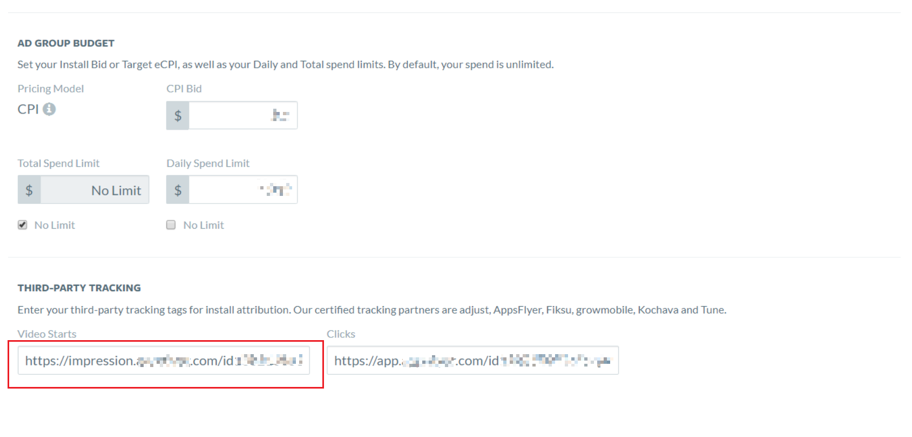
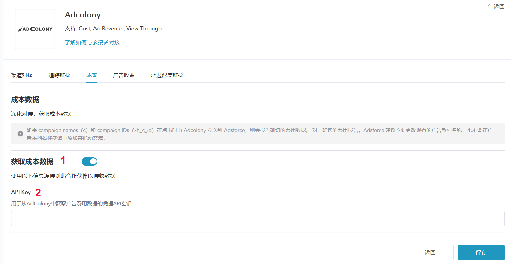
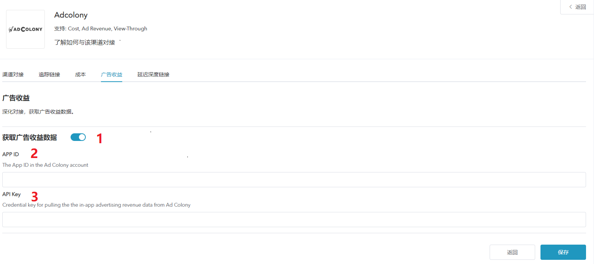

# **Adcolony 追踪配置**

# 概述

* AdColony 是一个视频广告网络，为广告主提供精确的受众群体和提供盈利方案；

* 除基于点击的移动效果分析外，AdColony 还提供费用、广告收入和浏览效果分析；

## Adcolony 追踪配置

  如需配置 Adcolony 请按以下步骤操作：

### 打开 Adcolony 配置窗口

##### 1. [登录 Adsforce 应用](<https://demo-portal.adsforce.io/login>)；

##### 2. 在“我的应用”列表项下，单击并选择需配置的应用程序；

##### 3. 在“配置管理 > 媒体平台”配置页面，搜索 “Adcolony” 并点击“编辑”；    

##### 4. 进入 **Adcolony** 配置窗口。

Adcolony 配置窗口包括5个选项：`渠道对接`、`追踪链接`、`成本`、`广告收益` 和 `延迟深度链接`

### 渠道对接

> **[info] 重要信息**
>
> 渠道对接完成后，便可获取**广告效果分析数据**。

#### SDK key

* Adsforce 是通过 SDK key 与 Adcolony 连接；
* SDK key 需从 Adcolony 中获取。

#### 启用曝光效果分析

如需属性为 Adcolony 的 view-through 安装。请将此选项切换为 **ON**。

#### 默认回传链接

* 如**仅回传** Adcolony 中的效果分析数据，请选择`Only event attributed to this partner`

* 如**回传所有**合作平台效果分析数据，请选择`Event attributed to any partner or oranganic`

### 追踪链接

> **[info] 重要信息**
>
> * 在此界面的所有参数只会生成一条**追踪链接**；
> * 此追踪链接仅适用于 Adcolony；
> * 使用追踪链接可更深入的分析研究产品。

#### 跟踪链接参数

* 添加的参数将会**在下方**追踪链接中显示；
* 在此添加参数可深入研究分析产品；
* 此处增删参数均可重新定义在跟踪链接上已添加的参数。

#### 点击效果分析

* 此滑块允许自定义设置**点击到安装**的时间；

* 可自定义设置 1~23 小时或 1~30 天；

* 此处设置的时间或日期将会在下方追踪链接中显示。

#### 点击追踪链接

* 此处链接显示了您设置的所有信息；

* 需复制点击追踪链接链接至 Adcolony。

##### 1. 点击“复制内容”；

###### 2. 将复制的链接发送到 Adcolony。

&ensp;&ensp;&ensp;1）[登录 Adcolony](https://clients.adcolony.com/login)；

&ensp;&ensp;&ensp;2）通过点击 “advertising > campaign name > ad group name” ，将复制的展示追踪链接粘贴至 “Clicks” 处。

#### 展示效果分析

* 此滑块允许您自定义设置**展示到安装**的时间；

* 您可以自定义设置 1~23 小时或 1~30 天；

* 此处设置的时间或日期将会在下方追踪链接中显示。

#### 展示追踪链接

* 此处链接可显示设置的所有信息；

* 复制此链接可**激活**观看相同类型的广告用户。          

######1. 点击“复制内容”；

&ensp; &ensp;

######2. 将复制的链接发送到 Adcolony。

&ensp;&ensp;&ensp;1）[登录 Adcolony](https://clients.adcolony.com/login)；

&ensp;&ensp;&ensp;2）通过点击 “advertising > campaign name > ad group name” ，将复制的展示追踪链接粘贴至 “Video Starts” 处。

  

### 成本

* 通过成本对接，可优化 Adcolony 推广成本数据；

* 在启用 Adcolony 启用成本数据之前，请确保已获取 Adcolony API Key。

#### 获取成本数据

如使用的成本数据效果分析来自 Adcolony，则需打开“获取成本数据”。

#### API key

* [API key](api-key/README.md) 用于验证**成本报表**中的 API；
* 更新后的数据窗口将于保存后即刻生效。

### 广告收益

* 通过广告收益对接，可从 Adcolony 获广告收益数据；
* 在启用 Adcolony 广告收益之前，请确保已获取 `APP ID` 和 `API Key`。

#### 获取广告收益数据

此处可切换广告收益数据的效果分析设置。

#### APP ID

[APP ID](app_id/README.md) 用于验证**广告收益报表**中的 API。

#### API Key

输入 [API key](api-key/README.md)。

