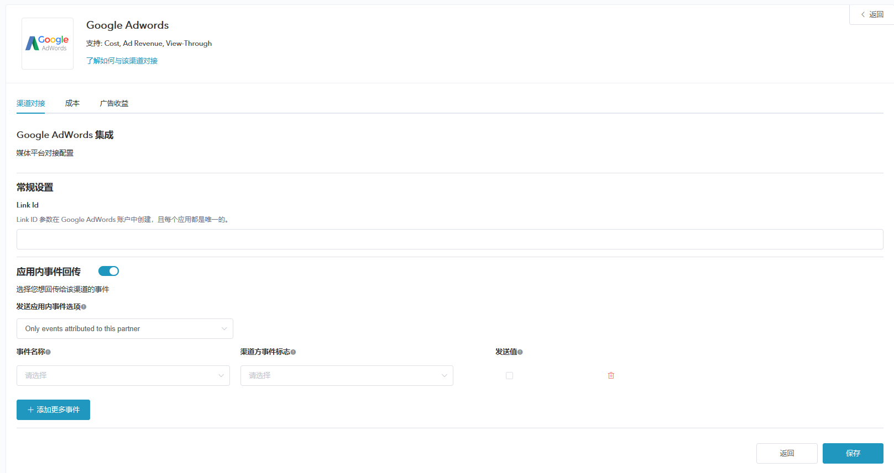

# **Google Adwords 追踪配置**

## **概述**

* Adwords 是 Adsforce 的集成合作伙伴之一，为广告提供 CPC、CPM 和指定站点广告发布服务；

* 除基于点击的移动效果分析外，Adwords 还提供费用、广告收入和浏览效果分析。

## **Adwords 追踪配置**

  如需配置 Adwords 请按以下步骤操作：

### 打开 Adwords 配置窗口

   1. [登录 Adsforce 应用](<https://demo-portal.adsforce.io/login>)；
  
   2. 在“我的应用”列表项下，单击并选择需配置的应用程序；
  
       
  
   3. 在“配置管理 > 媒体平台”配置页面，搜索 “Adwords” 并点击“编辑”按钮；
  
      
  
   5. 打开 **Adwords** 配置窗口。 

      

Adwords 配置窗口包括3个选项：`渠道对接`、`成本`、`广告收益` 

### 渠道对接配置

> **[info] 重要信息**
>
> 渠道对接完成后，便可获取**归因数据**。

渠道对接配置方法如下：

1. 输入[获取 LinkId](linkid/README.md)；
2. 选择并配置 Facebook 应用内事件（如需要）。

> **[success] 提示**
>
> **Link Id**
> Adsforce 是通过 Link Id 与 Adwords 连接，Link Id 需从 Adwords 中获取。
> **应用内事件回传**
> * 您若想回传给 Adwords 的事件，请将其打开。
> * 关于应用内事件的详细信息，可以参考[https://docs.adsforce.io/zh-hans/in-app-events/](https://docs.adsforce.io/zh-hans/in-app-events/)
> **发送应用内事件选项**
> * 若您想**仅回传 ** Adwords 中的归因数据，请选择`Only events attributed to this partner`
> * 若您想**回传所有**合作平台归因数据，请选择`Events attributed to any partner or oranganic`
> **事件设置**
> * 关于应用内事件，您需要设置事件名称、渠道方事件标志、发送值。
> * 您可以在[这里](../in-app-events/README.md)参考详细信息。

### 成本
通过成本对接，可优化您的 Adwords 推广成本数据。

> **[info] 重要信息**
>
> 在启用Facebook启用成本数据之前，请确保已授权Facebook。

成本配置步骤如下：

1. 获取成本数据

   如获取的成本数据归因来自 Adwords，则需打开`获取成本数据`。

2. 绑定 Google

   点击 `去 Google 授权` 按钮，进入 Google授权页面。

3. 选择广告账户

   选择广告账户后有助于加速获取成本数据。

> **[success] 提示**
>
> * 请使用 Google 的 Business 广告账号进行授权。
> * 如果您拥有超过10个广告账户，为更快捷的读取数据，请绑定对应的 App 广告账户。

### 广告收益

通过广告收益对接，可从 Adwords 获广告收益数据。

> **[info] 重要信息**
>
> 在启用 Adwords 广告收益之前，请确保已授权 Adwords。

广告收益配置步骤如下：
>  

1. 获取广告收益数据

 此处可切换广告收益数据的归因设置。

2. 绑定 Google

 如需获取成本数据，请在 Adwords 授权。

### 导入转化事件

Google Adwords 设置完成后，须从您的第三方应用分析提供商。
导入步骤如下：

1. 登录 [Adwords 信息中心](<https://ads.google.com/>)，点击帐户右上角的工具图标；

2. 在“度量”部分下，单击“转换”；

   

3. 要添加新的转化操作，请单击加号按钮；

   

4. 选择App转换类型。

   

5. 选择第三方应用分析选项后，点击 “CONTINUE” 按钮；

   

6. 选择应用的 first_open Analytics 事件；

7. 单击“导入并继续”。

> **[info] 重要信息**
>
> * 如未发现 first_open 事件，请在1小时后检查您的 AdWords 设置页；
> * 在创建 LinkID 后，first_open 事件通常需要1个小时才能导入。

