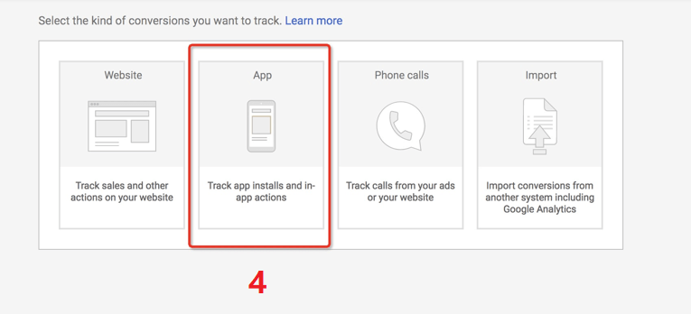

## Google AdWords 追踪配置

Adsforce与谷歌整合，应用程序开发人员可以在谷歌上自动运行广告系列，Adsforce将计算跟踪和衡量移动应用的转化情况。（阅读本文需要3min）

您需要操作以下四步。

### 1、确保集成了最新的Adsforce SDK

确保集成了最新的Adsforce SDK才能通过Link ID正确管理Google AdWords广告系列

### **2、**在Google AdWords信息中心中生成link ID

1)  打开<https://ads.google.com/>，点击帐户右上角的工具图标。

2) 在设置**部分，单击**关联的帐户。

3) 在第三方应用分析下，单击“ 详细信息”。

4) 从以下选项中选择创建链接ID：

如果您从未将任何应用分析提供商与AdWords帐户相关联，请点击创建链接ID。

如果您已将应用分析提供商与您的AdWords帐户相关联，并希望创建其他链接，请点击加号按钮以关联新的提供商或应用。

5) 选择其他提供商，关联Adsforce。然后输入Adsforce provider’ID：6602290452

6) 选择您的移动应用平台（安卓或iOS）。

7) 使用“查找您的应用”字段查找您的应用。

8) 单击“创建链接ID”。如果您在此步骤中看到错误请[联系我们](mailto:contact@upltv.com)。

9) 单击复制按钮以复制链接ID。您将在Adsforce的仪表板中添加它。

10) 单击“完成”。在您将链接ID添加到第三方帐户并且转化数据开始流入AdWords之前，您的状态将显示“未验证”。

 

### 3、在Adsforce的仪表板中添加您的链接ID

### 4、重要！ - 我们现在必须从您的第三方应用分析提供商导入转化事件

1) 在Adwords信息中心中再次点击工具图标。

2) 在“度量”部分下，单击“转换”。

3) 要添加新的转化操作，请单击加号按钮。

4) 选择App转换类型.

 

5) 选择第三方应用分析选项。

6) 选择您应用的first_open Analytics事件。

（注意：如果您看不到first_open事件，请在1小时后检查您的AdWords设置页。在创建LinkID后，first_open事件通常需要1个小时才能导入。）

7) 单击“导入并继续”。 

#### 

8）如果您需要获取成本数据，请在授权Google Adwords 后打开获取成本数据。

