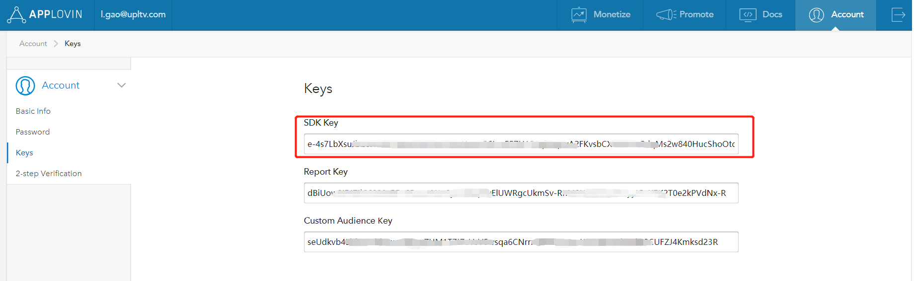
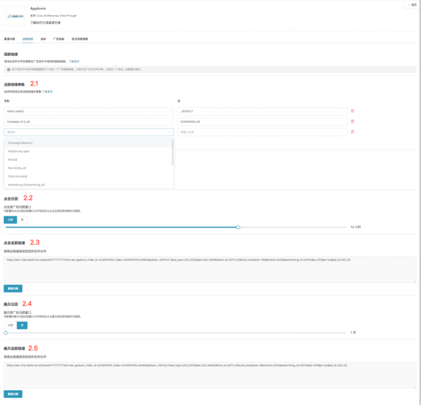

# 介绍

​     除了渠道对接之外，Applovin还提供成本、广告收益和延迟深度链接，您可以使用Adsforce进行跟踪。

​     除基于点击的移动归因外，Unity Ads还提供费用，广告收入和浏览归因。

​     如需配置Applovin请按以下步骤操作。

​     打开应用的媒体平台，搜索“Applovin”，单击打开**Applovin的配置窗口**

​      

​     Applovin的配置窗口包括5个选项卡：`渠道对接`、`跟踪链接`、`成本`、`广告收益`和`延迟深度链接`      

## **渠道对接**

​     完成渠道对接后，便可获取**归因数据**。     
​      

### **sdk_key**

​     Adsforce是通过sdk_key与Applovin连接，sdk_key需从Applovin中获取。  

### **启用曝光归因**

​     您若使用来自Applovin曝光归因，请将其打开。

### **默认回传链接**

​     若您想**仅回传**Applovin中的归因数据，请选择`Only event attributed to this partner`

​     若您想**回传所有**合作平台归因数据，请选择`Event attributed to any partner or oranganic`

## **追踪链接**

​     在此界面添加的所有参数只会生成一条**追踪链接**。

​     此追踪连接仅适用于Applovin。使用追踪连接可以对您的产品进行更深入的分析研究。

​      

### **跟踪链接参数**

​     添加的参数将会**在下方**追踪连接中显示。

​     在此添加参数可以使您对此进行深入研究分析。

​     此处增删参数都会重新定义在跟踪链接上已添加的参数。

### **点击归因**

​     此滑块允许您自定义设置**点击到安装**的时间。

​     您可以自定义设置 1~23 小时或 1~30 天 。

​     此处设置的时间或日期将会在下方追踪链接中显示。

### **点击追踪链接**

​     此处链接显示了您设置的所有信息。复制此链接发送到Applovin，可以**引导**您的潜在客户进行点击广告。

### **展示归因**

​     此滑块允许您自定义设置**展示到安装**的时间。

​     您可以自定义设置 1~23 小时或 1~30 天 。

​     此处设置的时间或日期将会在下方追踪链接中显示。

### **展示追踪链接**

​     此处链接显示了您设置的所有信息。复制此链接发送到Applovin，以便**激活**观看相同类型的广告用户。

​                                                                       

 

## **成本**

​     通过成本对接，可优化Applovin推广成本数据。

​     在启用Applovin启用成本数据之前，请确保您已经获取Applovin API Key。
   

### **获取成本数据**

​     您若使用来自Applovin成本数据归因，请将其打开。

### **API key**

​     广告主用于验证**成本报表**中的API。 

​     广告主需要向Applovin AM索要。

​     更新后的数据窗口将于保存后立即生效。

## **广告收益**

​     通过广告收益对接，可从Applovin获广告收益数据。

​     在启用Applovin广告收益之前，请确保您已经获取Report Key和App Package Name。

​      

### **获取广告收益数据**

​     您能在此切换广告收益数据的归因设置。

### **Report Key**

​     通过查询账户页面中的Key来获取Report Key以便验证**广告收益报表**中的API。

​     如果查询页面中的key为空，请发送邮件到Applovin进行查询。

### **App Package Name**

​     查询在Applovin应用程序的**包名**并输入。

