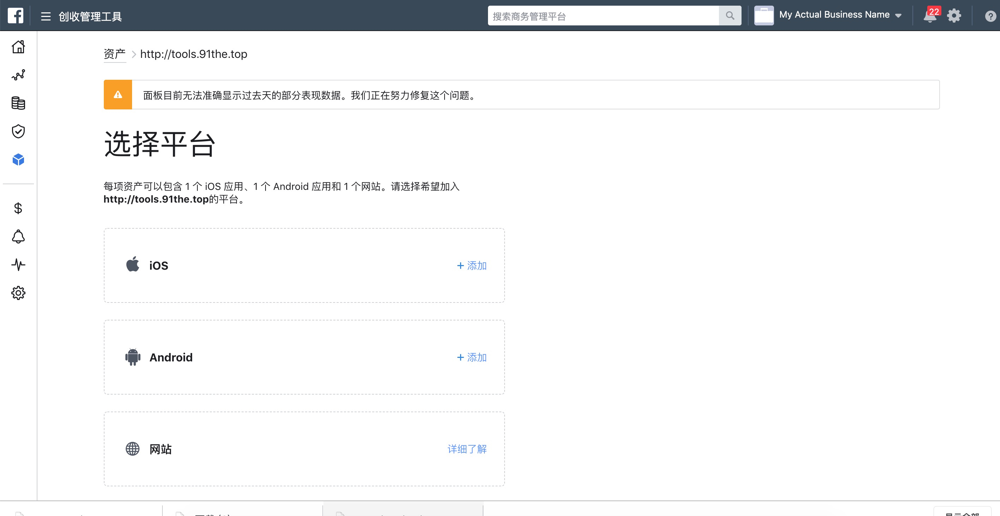

# Facebook 追踪配置

## 概述

* Facebook 是 Adsforce 的集成合作伙伴之一，为广告主提供精确的目标用户和用户习惯；
* 除点击效果分析外，Facebook 还提供成本、广告收益和曝光效果分析。

## Facebook 追踪配置

如需配置 Facebook 请按以下步骤操作。

### 打开 **Facebook** 配置窗口

###### 1. [登录 Adsforce 应用](<https://demo-portal.adsforce.io/login>)；

###### 2. 在“我的应用”列表项下，单击并选择需配置的应用程序；

###### 3. 在“配置管理” > “媒体平台”配置页面，搜索 “Facebook” 并点击“编辑”；

###### 4. 进入 **Facebook** 配置窗口。

 

Facebook 配置窗口包括 4 个选项：`渠道对接`、`成本`、`广告收益` 和 `延迟深度链接`。

### 渠道对接配置

###### 1. 输入[Facebook 应用编号和 Facebook 密钥](facebook-app-id-facebook-app-secret-configuration/README.md)；

###### 2. 选择并配置 Facebook 应用内事件（如需要）。

 

> **[success] 提示**
>
> **发送应用内时间选项**
> *Facebook 仅支持回传所有合作平台应用内事件。*
>
> * 如**仅回传 ** Facebook 中的应用内事件，请选择`Only event attributed to this partner`
> * 如**回传所有**合作平台应用内事件，请选择`Event attributed to any partner or oranganic`
>
> **事件名称**
> * 第一次启用 Facebook 应用程序内事件时，SDK 中将自动映射到 Facebook 的预定义事件列表；
> * 事件名称，Adsforce 从应用程序中集成的 SDK 或从服务器事件收到的事件名称；
> * 单击“添加事件”，渠道方事件标志将会默认添加；
> * 不选择发送值时，Adsforce 将会把应用内事件所有参数发送给合作伙伴，但收入值除外；
> * 选择发送值时，Adsforce 会发送所有参数，包括收入值；
> * 更新后的数据窗口将于保存后立即生效。

### 成本配置

通过成本对接，可优化您的 Facebook 推广成本数据。
> **[info] 重要信息**
>
> 在启用 Facebook 启用成本数据之前，请确保已授权 Facebook。

 

###### 1. 获取成本数据

   如需获取 Facebook 类成本数据，则需打开“获取成本数据”开关。

###### 2. 绑定 Facebook

&ensp;&ensp;1）点击“去 Facebook 授权”按钮，进入 Facebook 授权页面；

&ensp;&ensp;2）请使用 Facebook 的 Business 广告账号进行授权 
&ensp; &ensp; &ensp;（如您超过 10 个广告账户，为更快捷地读取数据，请绑定对应的应用广告账户）。
    

### 广告收益

通过广告收益对接，可从 Facebook 受众网络（Audience Network）获取广告收益数据。

> **[info] 重要信息**
>
> 在启用 Facebook 广告收益之前，请确保已授权 Facebook。

 

###### 1. 获取广告收益数据

  如需获取 Facebook 类广告收益数据，则需打开“获取广告收益数据”开关。

###### 2. 绑定 Facebook

   点击“去 Facebook 授权”按钮，进入 Facebook 授权页面。

### 延迟深度链接

深度链接适用于市场推广活动。
可通过以下三步完成操作：

###### 1. 完成 Facebook 授权；

###### 2. 默认生成一条延迟深度链接（Deferred Deeplink）；

###### 3. 通过登录 Facebook 账户 > 创建某一广告系列（campaign）> 创建广告组页签 > 创建某一广告组（adset）> 进入广告（Ad）选中某一广告，将复制的延迟深度链接（Deferred Deeplink）粘贴到 Facebook 账号的“延迟深度链接）”处；

###### 4. 在 Adsforce “配置管理” > “媒体平台” > “Facebook” 配置页面中，点击“验证”可验证延迟深度链接是否关联。

> **[success] 提示**
> 
> * 点击“验证”即可帮您验证是否已关联；
> * 状态显示“已验证”，即完成一次配置；
> * 直接复制或编辑生成的延迟深度链接（Deferred Deeplink）后，将该链接拷贝到 Facebook 账号 Ad 的指定位置；
> * 不同的 Campaign 不能共用同一个延迟深度链接（Deferred Deeplink）；
> * 链接最多添加 10 条（编辑按钮可修改链接地址）；
> * 更新后的数据窗口将于保存后即刻生效。

### 验证状态流程图与操作

> **[success] 提示**
> 
> 蓝色按钮为状态图。白色按钮为操作。黑色字体为其他页面及系统操作。
