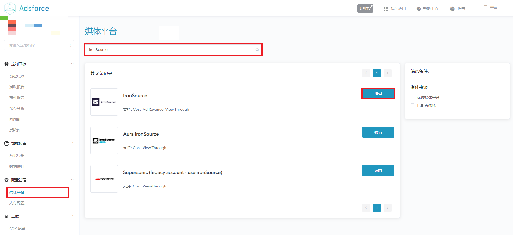
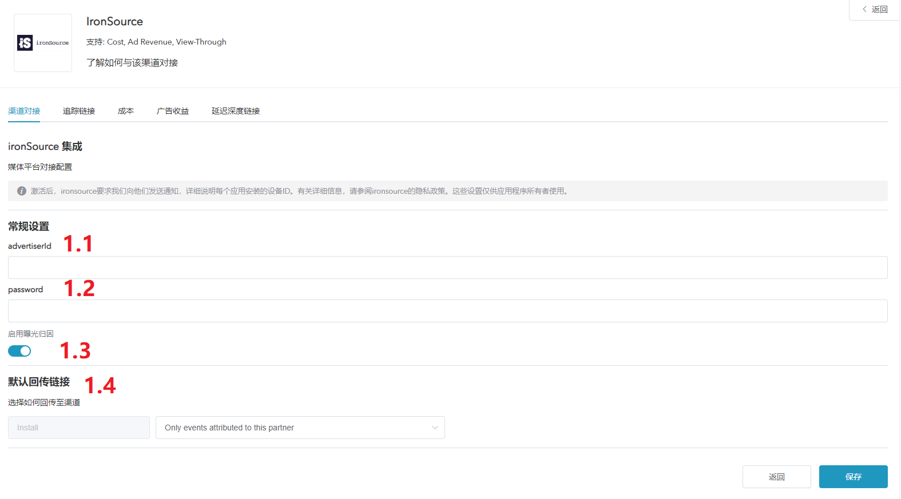
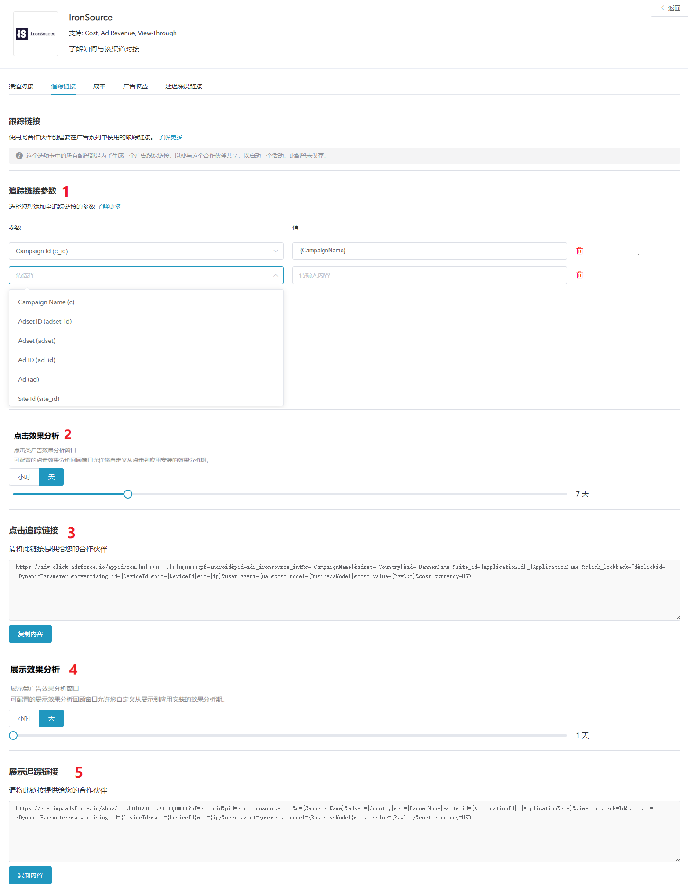
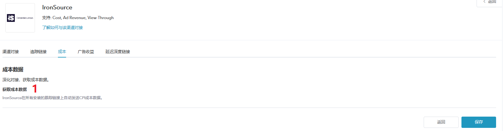

# 介绍

* IronSource是Adsforce的集成合作伙伴之一，为广告主提供互动、分析等功能。

* 除基于点击的移动归因外，IronSource还提供费用，广告收入和浏览归因。

* 如需配置IronSource请按以下步骤操作。

* 打开应用的媒体平台，搜索“IronSource”，然后单击打开**IronSource的配置窗口**。

* IronSource的配置窗口包括5个选项卡：`渠道对接`、`跟踪链接`、`成本`、`广告收益` 和 `延迟深度链接`      

## 渠道对接

* 渠道对接完成后，便可获取**归因数据**。          

### advertiserId

* advertiserId需从IronSource中获取，Adsforce是通过advertiserId和password与IronSource连接。 

### password

* password需从IronSource中获取，如您没有advertiserId和password需从IronSource获取。 

### 启用曝光归因

* 您若使用来自IronSource曝光归因，请将其打开。

### 默认回传链接

* 若您想**仅回传**Applovin中的归因数据，请选择`Only event attributed to this partner`

* 若您想**回传所有**合作平台归因数据，请选择`Event attributed to any partner or oranganic`

## 追踪链接

* 在此界面添加的所有参数只会生成一条**追踪连接**。

* 此追踪连接仅适用于IronSource。使用追踪连接可以对您的产品进行更深入的分析研究。

### 跟踪链接参数

* 添加的参数将会**在下方**追踪连接中显示。

* 在此添加参数可以使您对此进行深入研究分析。

* 此处增删参数都可以重新定义在跟踪链接上已添加的参数。

### 点击归因

* 此滑块允许您自定义设置**点击到安装**的时间。

* 您可以自定义设置 1~23 小时或 1~7 天 。

* 此处设置的时间将会在下方追踪链接中显示。

### 点击追踪链接

* 此处链接显示了您设置的所有信息。
       
* 复制此链接发送到IronSource，可以**引导**您的潜在客户进行点击广告。

### 展示归因

* 此滑块允许您自定义设置**展示到安装**的时间。

* 您可以自定义设置 1~23 小时或 1~7 天 。

* 此处设置的时间将会在下方追踪链接中显示。

### 展示追踪链接

* 此处链接显示了你设置的所有信息。

* 复制此链接发送到IronSource，以便**激活**观看相同类型的广告用户。

  

## 成本

* 通过成本对接，可优化您的IronSource推广成本数据。

* 在启用IronSource启用成本数据之前，请确保您已经开启获取成本数据。

### 获取成本数据

* 您若使用来自IronSource成本数据归因，请将其打开。

## 广告收益

* 通过广告收益对接，可从IronSource获广告收益数据。

* 在启用IronSource广告收益之前，请确保您已经获取User Name和App ID。     

### 获取广告收益数据

* 您能在此切换广告收益数据的归因设置。

### User Name

* 通过查询账户页面中的Key来获取User Name以便验证**广告收益报表**中的API 。

* 创建APP之后IronSource会自动赋予给您。

### App ID

* 通过查询账户页面中的Key来获取App ID以便验证**广告收益报表**中的API 。

### Secret Key

* 查询在IronSource应用程序的**Secret Key**并输入。

* Secret Key需要向IronSource AM索要。

