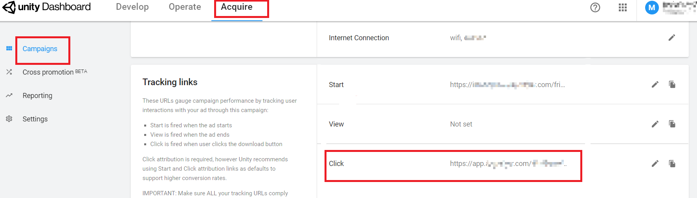
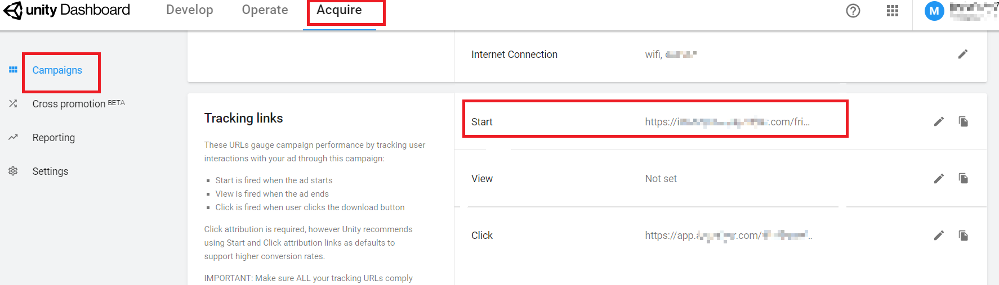

# 介绍

* Unity Ads是Adsforce的集成合作伙伴之一，为广告主提供于iOS和Android的视频推广。

* 除基于点击的移动归因外，Unity Ads还提供费用，广告收入和浏览归因。

* 如需配置Unity Ads，请按以下步骤操作。

* 打开应用的媒体平台，搜索“Unity Ads”，单击打开**Unity Ads**的配置窗口。     

 

* Unity Ads配置窗口包括5个选项：`渠道对接`、`跟踪链接`、`成本`、`广告收益` 和 `延迟深度链接`      

## 渠道对接

* 渠道对接完成后，便可获取**归因数据**。     

 

### Unity Ads Game ID

* Adsforce是通过Unity Ads Game ID与Unity Ads连接，Unity Ads Game ID需从Unity Ads中获取。  

### 启用曝光归因

* 您若使用来自Unity Ads曝光归因，请将其打开。

### 默认回传链接

* 若您想**仅回传**Unity Ads中的归因数据，请选择`Only event attributed to this partner`

* 若您想**回传所有**合作平台归因数据，请选择`Event attributed to any partner or oranganic`

## 追踪链接

* 在此界面添加的所有参数只会生成一条**追踪链接**。

* 此追踪连接仅适用于Unity Ads。

* 使用追踪连接可以对您的产品进行更深入的分析研究。

 

### 跟踪链接参数

* 添加的参数将会**在下方**追踪连接中显示。

* 在此添加参数可以使您对此进行深入研究分析。

* 此处增删参数都可以重新定义在跟踪链接上已添加的参数。

### 点击归因

* 此滑块允许您自定义设置**点击到安装**的时间。

* 您可以自定义设置 1~23 小时或 1~30 天 。

* 此处设置的时间或日期将会在下方追踪链接中显示。

### 点击追踪链接

* 此处链接显示了您设置的所有信息。

* 复制此链接发送到Unity Ads，可以**引导**您的潜在客户进行点击广告。

### 展示归因

* 此滑块允许您自定义设置**展示到安装**的时间。

* 您可以自定义设置 1~23 小时或 1~30 天 。

* 此处设置的时间或日期将会在下方追踪链接中显示。

### 展示追踪链接

* 此处链接显示了你设置的所有信息。

* 复制此链接发送到UnityAds，以便**激活**观看相同类型的广告用户。

 

## 成本

* 通过成本对接，可优化您的UnityAds推广成本数据。

* 在启用UnityAds启用成本数据之前，请确保您已经获取API Key和组织ID。 

 

### 获取成本数据

* 您若使用来自Unity Ads成本数据归因，请将其打开。

### API key

* 广告主用于验证**成本报表**中的API 。

* 更新后的数据窗口将于保存后立即生效。

 

### 组织Id

* 广告主用于抓取**成本报表**中的组织Id。 

* 更新后的数据窗口将于保存后立即生效。

 

## 广告收益

* 通过广告收益对接，可从Unity Ads获广告收益数据。

* 在启用Unity Ads广告收益之前，请确保您已经获取GAME ID和API Key。

 

### 获取广告收益数据

* 您能在此切换广告收益数据的归因设置。

### GAME ID

* 广告主用于验证在**广告收益**中产生收益的详细GAME ID。

* 更新后的数据窗口将于保存后立即生效。。

### API Key

* 查询在Unity Ads应用程序的**API Key**并输入。

