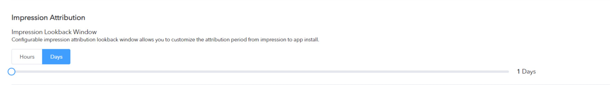

# Attribution

## What is Mobile Attribution?

Mobile attribution

Determining that a mobile app install or post-install event is the result of a particular media source engagement.

Mobile attribution is essential for optimizing user acquisition and re-engagement efforts and results.

All players in the mobile marketing ecosystem, from Google Play and iTunes, ad networks such as Facebook and Twitter, to the mobile tracking companies, have their own mobile attribution models. Therefore, by definition **all players count installs and events differently. **

 

## What is a Mobile App Install?

Adsforce's attribution model states that an **install is recorded only after the user downloads and launches the mobile app**. Therefore, the time stamp of an app install is always the first launch.

In contrast, ad networks regard the engagement time as the install time, while app stores use the download time.

 

## User Engagement Attribution Types

The type using by Adsforce to record and use for user engagement attribution: Click-through and Impression attribution.

 

| Click-Through Attribution                                    |
| ------------------------------------------------------------ |
| Most attributed mobile installs come from user clicks on ads: banners, videos, interstitials etc. clicking Adsforce upon the ad will open a lookback window, which lasts 7 days by default.  **Installs occurring within the lookback window are considered as non-organic and are attributed to the media sources, while others are considered as organic installs. **     Adsforce recommends using the 7-day click lookback window, which is the industry standard. However, you can customize the time period to 1-30 days based on the agreement you have with your media sources. For example, Facebook uses a 28-day click-through lookback window, Twitter uses 14 days and Google Ads uses 30 days. You can match Adsforce’s click-through lookback window to any of these values. |

| Impression Attribution                                    |
| ------------------------------------------------------------ |
|View-through Attribution gives marketers visibility into when and where ads are being served through Impression tracking. |

| **Attribution Type**      | **Attribution Method**    | **Clicks Lookback Window** |        |
| ------------------------- | ------------------------- | -------------------------- | ------ |
| | | **Range**                 | **Recommended (default)** |                            |        |
| Click-Through (All Integrated Partners)             | Referrer, ID Matching     | 1 – 30 Days                | 7 Days |
|  Click-Through (All Integrated Partners) | Fingerprinting            | Fixed                      | 1 Day  |
| Impression（Selected media sources） | ID Matching            | 1h-7 Days                      | 1 Day  |

The click fingerprinting attribution lookback window is limited to a maximum of 24 hours on iOS and much less on Android to maintain a high level of accuracy.

 

## Advanced Attribution Topics

| Assisted Installs                                            |
| ------------------------------------------------------------ |
| Adsforce fully attributes only one media source per install, usually according to the last ad click or the last ad impression (if there were no clicks). 
Assisted Installs (AKA multi-touch attribution) are installs where the Media-Source/Campaign did not have the last touch, but did touch the user before the install and this took place within their attribution lookback window. The assisting networks get credit as contributors to the install on Adsforce's dashboard and raw data. |

## Introduction to Adsforce Attribution

The purpose of marketing attribution is to evaluate the influence each advertising impression has on a mobile-user’s decision to perform an event as a result of viewing a mobile app ad. This allows marketers to determine the true value of their online efforts.

#### Introduction

Being able to see what influences the audience and to what extent allows marketers to optimize media spend for conversions and compare the value of different marketing channels, including paid and organic search, email, display ads, social media and more.

#### Attribution Model

An attribution model is the rule, or set of rules, that Adsforce uses to determine how credit for an event is assigned to touchpoints in conversion paths. For example, last touch attribution assigns 100% credit to the final click immediately prior to sales or conversions.

#### Attribution Methods

Adsforce uses a variety of attribution methods, as following：

| Attribution        | Android(google Play) | Android(out of Store) | IOS  |
| ------------------ | -------------------- | --------------------- | ---- |
| Referrer           | √                    | √                     | √    |
| Device ID Matching | √                    | √                     | √    |
| Fingerprinting     | √                    | √                     | √    |

The method that you choose to use for the attribution of events depends on the platform and the store (Google Play Store、iOS App Store or Amazon), whether the type of engagement used was click-though, view-through or the conversion type (install or in-app event).

