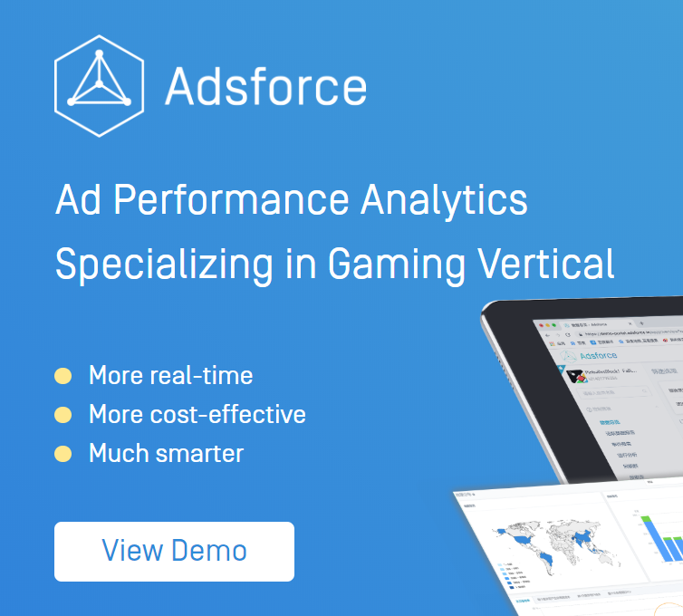

# Getting Started

## Adsforce Access Process

### View&ensp;Demo
##### 1. Visit [Website](https://www.upltv.com/cn/analytics) and click on  "View Demo".

##### 2. Fill in your information and apply to view Demo.

After clicking on Demo and filling in required information, we will contact and send demo to you. Meanwhile, we will help you select the most cost-effective package based on your business size and budget.

> **[warning] Note**
>
> * Currently only advertisers can get access;
> * For media and agents partners interested in cooperation, please send email to [contact@upltv.com](mailto:contact@upltv.com).

### Select A Mode and Use Adsforce

Select a mode from:  
* Standard SaaS
* Private (Customized)

#### Standard&ensp; SaaS&ensp; Mode

Adsforce server offers multiple features to advertisers, including attribution, reporting, ad revenue tracking, cohort analysis, anti-fraud etc. To begin your journey with Adsforce please follow instructions below:

- [Sign-up](sign-up-adsforce/README.md) for a new AppsFlyer account or [add team members](add-team-members/README.md) to existing accounts;
- [Add your app](add-apps/README.md) to the Adsforce dashboard;
- [Download and integrate the SDK](../sdk-integrations/README.md): [Android](../sdk-integrations/quick-start/Android/README.md), [iOS](../sdk-integrations/quick-start/iOS/README.md) or [Unity](../sdk-integrations/quick-start/Unity/README.md);
- [Media Source Configurations (Facebook and Google, etc.);

- [Reporting](../reporting/README.md).

#### Private&ensp; Mode

We provide private mode solution for key accounts. Please email [contact@upltv.com](mailto:contact@upltv.com) for more information.

