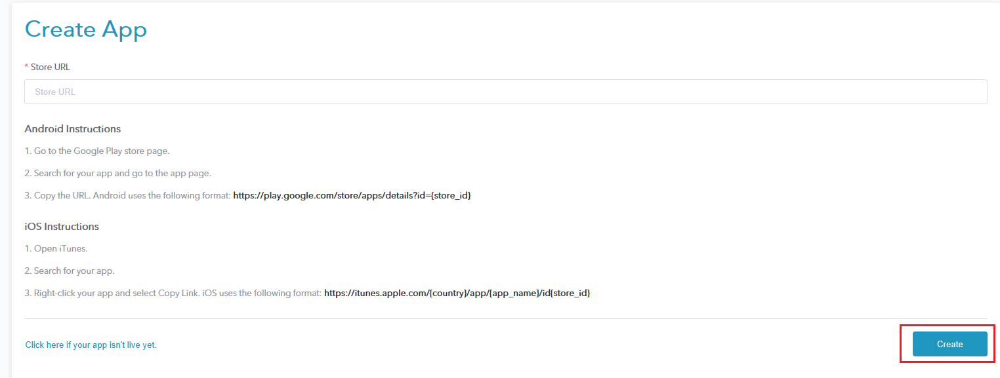
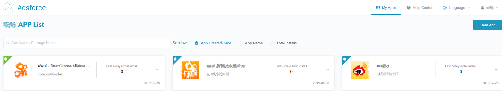
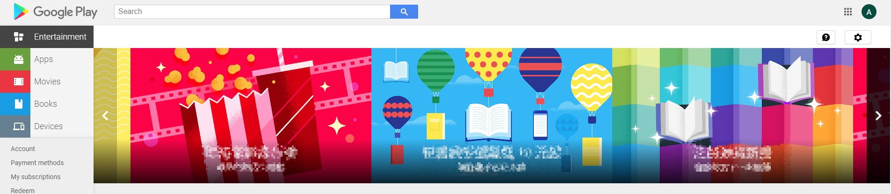
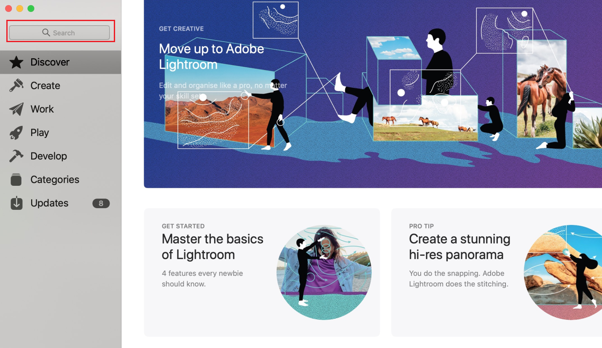
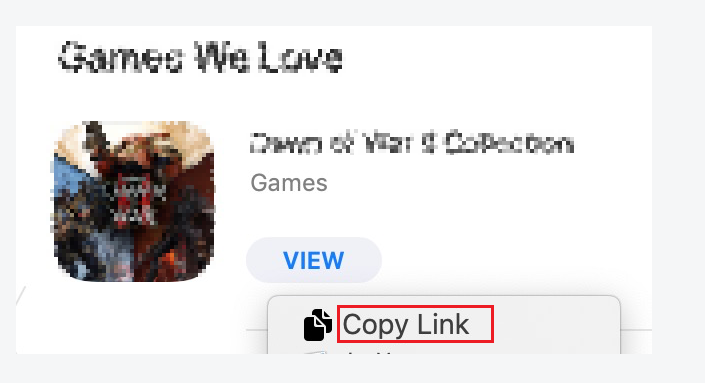

# Add a New App to the Adsforce Dashboard

> **[warning] Note**
>
> This feature is only enabled for account owners.

###### 1. In Adsforce dashboard, click "Add App";

###### 2. The "Create App" window is opened;

###### 3. Click "Create" to create an App;

###### 4. The details of the new App can be seen.

Select one of the three options to get **App Store URL**:

###### 1. **Android Instructions**

&ensp;&ensp;1) Open [Google Play](https://play.google.com/store)  from your computer;

&ensp;&ensp;2) Enter and search for your App;

&ensp;&ensp;3) Right-click your App and copy link address.

> **[success] Tip**
>
> You can also create an App using your Android phone, as follows:

&ensp;&ensp;1) Click the Play Store icon after downloading Google Play app;

&ensp;&ensp;2) Go to the Google Play store page.;

&ensp;&ensp;3) Search for your App and go to App page;

&ensp;&ensp;4) Copy URL。

Android uses the following format: https://play.google.com/store/apps/details?id={store_id}

###### 2. **iOS Instructions**

&ensp;&ensp;1) Open iTunes;

&ensp;&ensp;2) Search for your App；

&ensp;&ensp;3) Right-click your app and select Copy Link.

iOS uses the following format: https://itunes.apple.com/{country}/app/{app_name}/id{store_id}

###### 3. Pending Approval or Unpublished
If your App is not available yet (pending approval / unpublished status), create App with the following steps:

&ensp;&ensp;1) Click "Click here if your app is not live yet" at the bottom of the page;

&ensp;&ensp;2) Enter App name, select platform (iOS / Andriod), and enter Package name / App ID  in "New App" page;

&ensp;&ensp;3）Once you have entered the required information, then click "Create";

&ensp;&ensp;4）Your app is now fully added to your App list.

