# Adsforce Link Configuration

Create custom tracking links to track and measure the partner media sources in order to increase game installs and new user engagement.

## Create&ensp;Links

To analyze partner media sources performance successfully, you need to create and manage your **Adsforce Links**.

### Set Up Adsforce Links

##### 1. [Login Adsforce](https://demo-portal.adsforce.io/login);

##### 2. Click your App under "My Apps";

##### 3. Select "Configuration" > "Adsforce Link Configuration";
&ensp;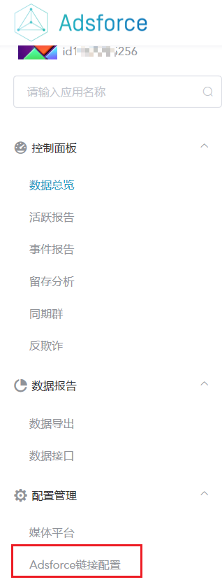
##### 4. Go to “**Link Management**” configuration window.

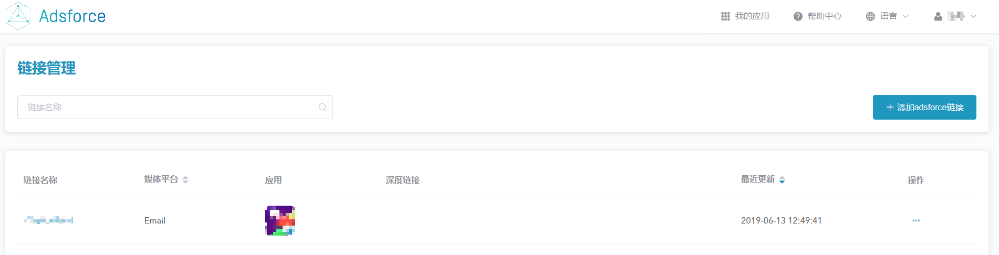

Creating Adsforce Links
--------------

Please create Links if you haven't already:

### General Settings

##### 1. Click "Add Custom Adsforce Link";

&ensp;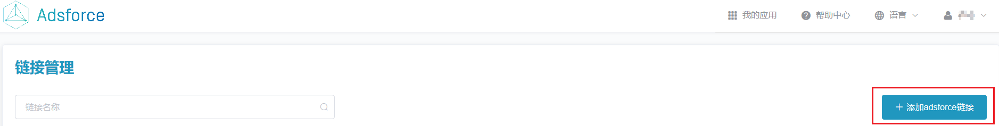

##### 2. Name the new link with an easily recognizable name in "Link Management" > "Custom Tracking Link";

&ensp;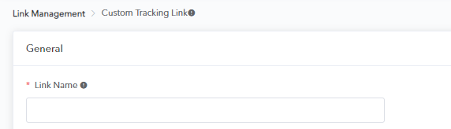

##### 3. Select the app you intend to add link (single-platform);

&ensp;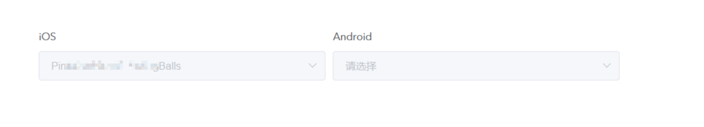

##### 4. The link gets an automatic shorter URL.

- You can use the generated shortlink ID, or customize the link to brand your link;
- Select both an iOS and an Android app or single app to generate a link preview.

> **[warning] Note**
>
> This cannot be changed after you create the link.

&ensp;

### Ad Performance Analytics Settings

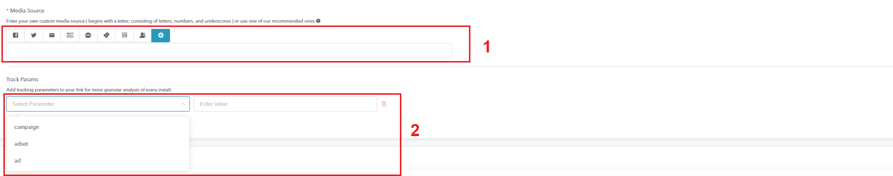

###### 1. Set the Media Source Name

Enter your partner media sources source name ( begins with a letter, consisting of letters, numbers, and underscores ) manually in the box or click one of the tabs (e.g. “Email”). 

> **[success] Tip**
>
> - To properly differentiate between your custom tracking links and adsforce integrated partners tracking links, do not use "Facebook", "Facebook Ads", "GoogleAdwords", "Twitter" or "Organic" as your custom media source name (case insensitive);
> - Using these names for custom tracking links may affect your performance analytics data's integrity as installs from your partner media sources would get attributed to integrated partners;
> - You can use letters (a-z, A-Z), digits (0-9) and "_", but refrain from using other special characters. The first letter must not be a number.

###### 2. Tracking Parameters

Add tracking parameters to your link for more granular analysis of every install.

> **[info] Important**
>
> - campaign - add it to compare different campaigns within the partner media sources source.;
> - **Adset** - set ad set names to compare different ad sets within specific campaigns of the media source;
> - **Ad Name** - set ad set names to compare different creatives within specific ad sets within specific campaigns of the partner media sources source.

### Deep Linking and Redirection Configuration

##### 1. Deep Link URL

Deep linking is the act of launching a mobile app while serving personalized content and/or sending the users to specific activities within the app. By doing so you can provide your users with superior user experience, which can greatly enhance their engagement with your apps.

The deep link (af_dp) can be configured by entering the URL scheme.

##### 2. Redirection

Add platform specific redirection for users instead of directly to the App stores.

Redirect is available by clicking **Add Parameter** > **Select a Redirection** > **Enter Value**.

> **[success] Tip**
>
> The "URL address" should begin with https:// or http://.

### Advanced Settings

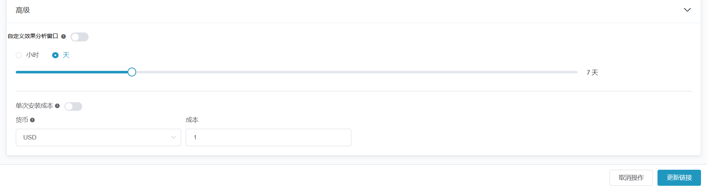

##### Customize Lookback Window

To set the the maximum CTIT (Click Time to Install), turn on the Customize Lookback Window switch.

This window's duration is the maximum CTIT (Click Time to Install) for the new user to be analyzed to the source displaying the ad / link.

The default value is 7d.

##### Cost Per Install

Enable to apply a global cost value for each install.

##### Currency

The currency in which to record the cost associated to this install，At https://finance.yahoo.com/currencies/on the day rate calculation cost!

Link&ensp;Management
---------------

The Link management system serves as your go-to screen for creating, editing, deleting, and duplicating Performance Analytics links.

### Get Link Management Configuration Window

1. Click **Configuration** > **Adsforce Link Configuration** in Adsforce Dashboard;

2. Go to **Link Management** configuration window （Refer to "Set Up Adsforce Links" for details）.

### View Link Details

#### Edit Your Existing Links

##### 1. Click an existing link's name to view or modify its previous setup;

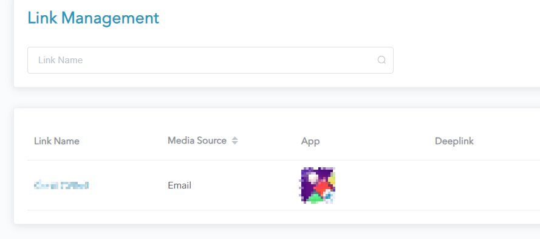

##### 2. Once you're finished click "Update Link".

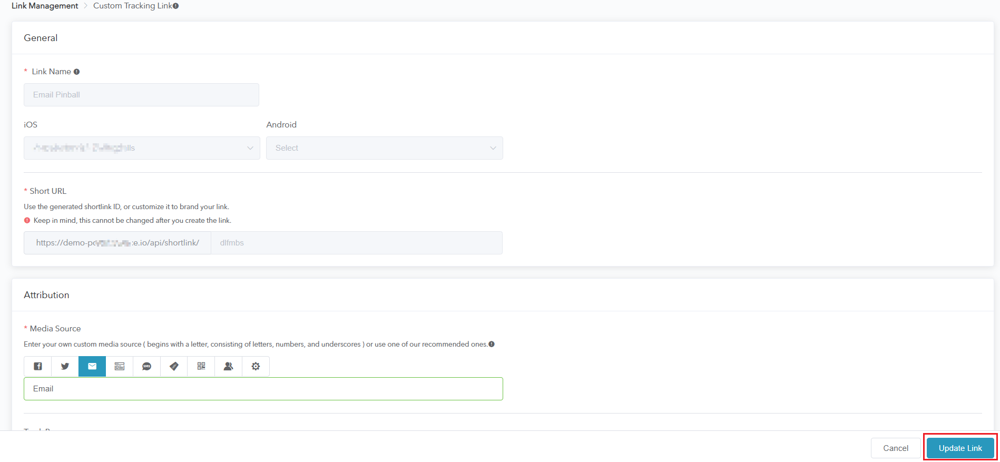

#### Actions Button

There are several actions you can perform per link by clicking on its ***Actions*** button:

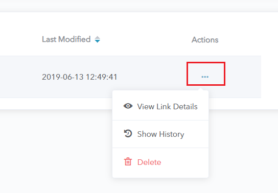

##### 1. *View Link Details* shows the saved link's short and long URLs;

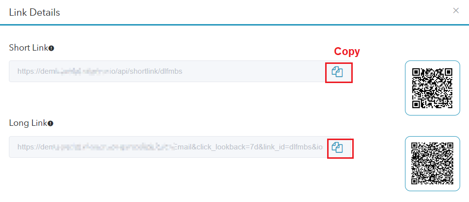

> **[warning] Note**
>
> You can only view, but not modify, the links on this page;
>
> You can copy or download the the short or long URLs through clicking the *Copy* button or scanning the QR code image. 

##### 2. *Show History* provides an audit of the users that have created or modified the link, from the latest modification to the first creation;

##### 3. The ***Delete*** option only removes the link from the Link Management table, any existing links still redirect.

### Short vs Long URLs

- Short URLs enable **campaigns with limited text space**;
- Short URLs **enable you to change the used parameters once on Adsforce's dashboard, and affect links on the fly**. 

