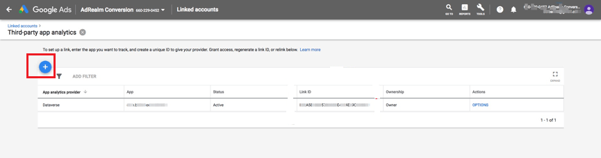
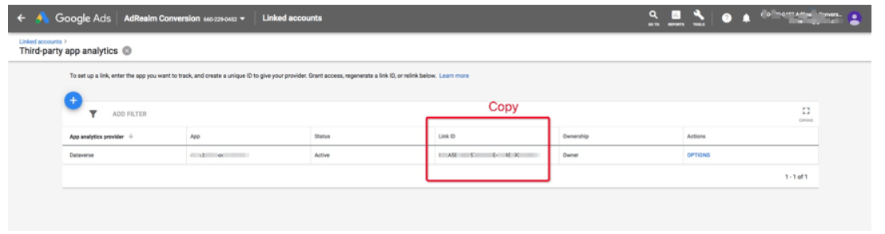

# Link ID

Adsforce connects to Adwords via a link ID, taking from Adwords.

The acquisition method is as follows:

##### 1. Go to your [Google Ads](https://ads.google.com/) and click the **Tools** icon

##### 2. Select “Linked accounts”;

##### 3. Under Third party app analytics, click **DETAILS**;

##### 4. Choose Create Link ID from the following options:

- If no App analytics provider is linked with your AdWords account, click **CREATE LINK ID**;

   

   

- If you've linked your app analytics provider to your AdWords account and need to create additional links, and click the plus button to link to a new provider or App.

   

##### 5. Select another provider to link with Adsforce, then enter your Adsforce Provider's ID: **6602290452**;

##### 6. Select your mobile App's platform (Android or iOS);

##### 7. Look up your App to find your App;

##### 8. Click **CREATE LINK ID** (please feel free to [contact us](mailto:contact@upltv.com) if any questions);

##### 9. Copy link ID (for adding it in Adsforce Dashboard > Link ID);

##### 10. Click **Finish**.

   > **[success] Tip**
   >
   > The status will be displayed as "Unverified" until the link ID is added to the third-party account and conversion data begins importing into AdWords.

