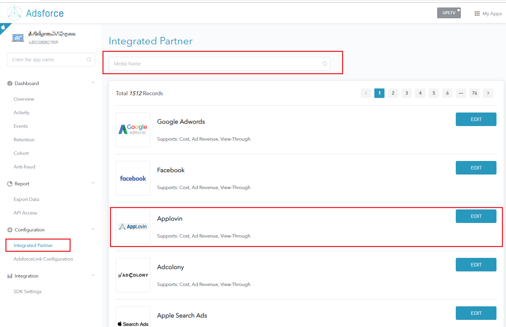
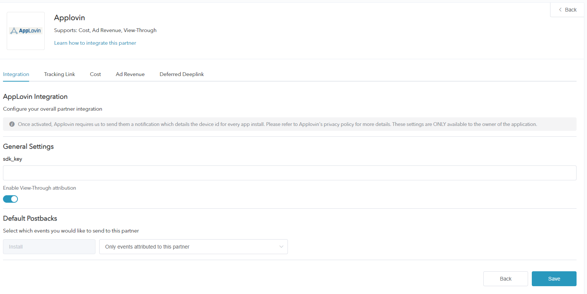
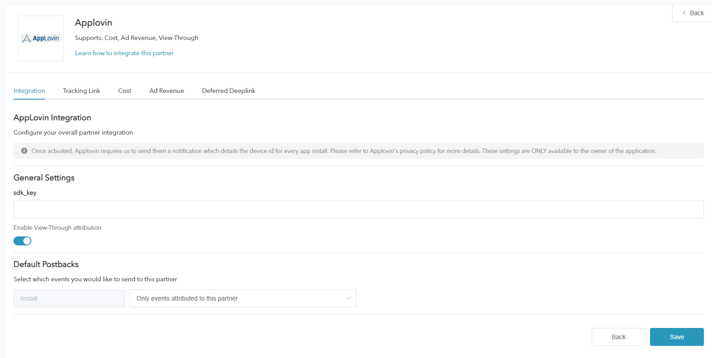
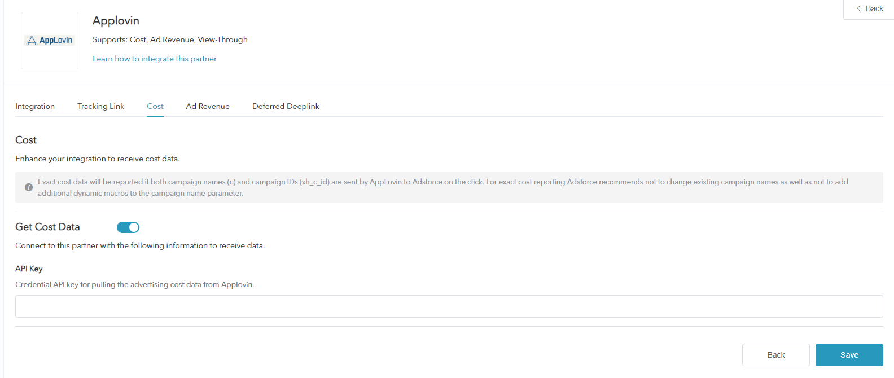
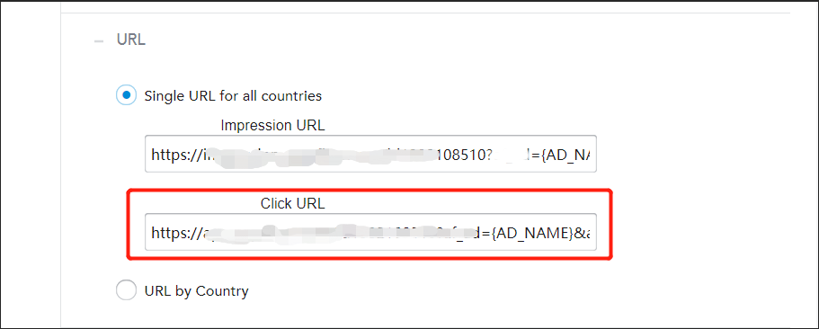

# How to Configure a Campaign with Applovin

* Applovin is one of Adsforce's integrated partners, providing advertisers with precise target users and user habits;

* In addition to click-based performance analysis, Applovin also supports other types of performance analysis such as cost, ad revenue, and view-through.

## Applovin Integration

To configure your campaigns with Applovin, follow the steps below.

### Set Up Applovin

###### 1. [Login Adsforce](https://demo-portal.adsforce.io/login);

###### 2. Click your App under "My Apps";

   

###### 3. Under "Configuration" > "Integrated Partner ", search "Applovin" and click "EDIT";

 

###### 4. Go to Applovin's configuration window.

   

 Applovin's configuration window includes 5 options: `Integration`, `Tracking Link`, `Cost`, `Ad Revenue` and `Deferred Deeplink`.

### Applovin Integration

> **[info] Important**
>
> You can get **Performance Analytics Data** after integration.

 

#### SDK Key

-  Adsforce is connected to Applovin via sdk_key;
- SDK Key is available from Applovin.

&ensp;&ensp;&ensp;&ensp;Method on getting SDK Key:

######&ensp;&ensp;&ensp;&ensp;1. [Login Applovin](https://dash.applovin.com/login)；

######&ensp;&ensp;&ensp;&ensp;2. Select **Keys** > **SDK Key** under **Account**.

#### Enable View-Through Performance Analytics

Toggle this to ON if you want to analyze view-through installs from Applovin. 

#### **Default Postbacks**

* Select `Only event attributed to this partner` for events coming **only** from users attributed to Applovin;
* Select `Event attributed to any partner or oranganic` to have your **entire** user base available to be reported to Applovin.

### Tracking Link

> **[info] Important**
>
> * All parameters added in this page will only generate a **tracking link**;

> * This tracking link is only available for Applovin；

> * You can in-depth analyze your product using the tracking link.

### Tracking Link Parameters

* The added parameters will be displayed in the **Tracking link** below;

* You can in-depth analyze your product through adding parameters here;

* Adding and deleting parameters here can redefine the parameters added on the tracking link.

#### Click-Through Performance Analytics

* Configurable click performance analytics lookback window allows you to customize the performance analytics period from **click to app install**;

* Customizable settings 1~23 hours or 1~30 days;

* The time or date set here will appear in the tracking link below.

### Click Tracking Link

* The link here shows all the setting information;

* The click tracking link will be copied to link to Applovin.

######&ensp;&ensp;&ensp;&ensp;1. Click **Copy Content**;

######&ensp;&ensp;&ensp;&ensp;2. Send the copied link to Applovin.

&ensp;&ensp;&ensp;&ensp;&ensp;&ensp;1) In **Campaign**, click on a campaign;

&ensp;&ensp;&ensp;&ensp;&ensp;&ensp;2) Click on **Edit Campaign Targeting**;

&ensp;&ensp;&ensp;&ensp;&ensp;&ensp;3) Click **URL** under **Edit Targeting** and jump to URL page.

&ensp;&ensp;&ensp;&ensp;&ensp;&ensp;4) Paste the "Click Tracker".

### Impression Performance Analytics

* Configurable impression performance analytics lookback window allows you to customize the performance analytics period from **impression to App install**;

* Customizable settings 1~23 hours or 1~30 days;

* The time or date set here will be appeared in the tracking link below.

### Impression Tracking Link

* The link here shows all the setting information;

* Impression Tracking Link can **activate** the Ad users viewing the same type of App.

######&ensp;&ensp;&ensp;&ensp;1. Click **Copy Content**;

######&ensp;&ensp;&ensp;&ensp;2. Send the copied link to Applovin.

&ensp;&ensp;&ensp;&ensp;&ensp;&ensp;1) Click URL on the left in Campaign page and jump to URL item.

&ensp;&ensp;&ensp;&ensp;&ensp;&ensp;2) Paste **Impression Tracking Link**.

 

### Cost Configuration

> **[info] Important**
>
> * Your Applovin cost data can be enhanced through cost integration;

> * Make sure you have got Applovin API Key before enabling Applovin cost data.

 

#### Get Cost Data

To get Applovin cost data, you need to turn on **Get Cost Data**.

#### API key

* API Key is used to verify the API in **Cost Report**;

* You need to ask Applovin AM for API key;

* The updated data window will take effect until saved.

### Ad Revenue

* Ad revenue data can be received from Applovin through Ad revenue integration;

* Make sure you have got Report Key and App Package Name before enabling Applovin advertise revenue.

 

#### Get Ad Revenue Data

Here you can set performance analysis for Ad revenue data.

To get Applovin Ad revenue data, you need to turn on **Get Ad Revenue Data**.

#### Report Key

Get the report key by **Applovin** > **Account** > **Keys** > **Report Key** to verify the API in **Advertising Revenue Report**.

> **[warning] Note**
>
> If you cannot find the Key in **Keys** page, send an email to Applovin for enquiry.

#### App Package Name

Get the App package name in Applovin via **Applovin** > **Monetize** > **Manage App** > **Basic Settings** > **Application Name**.

