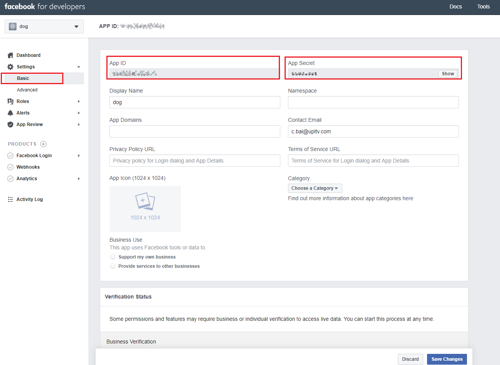

# Facebook App ID and Secret

- Configure Facebook App ID and Secret in Adsforce Dashboard;
- The App ID and Secret are used for integrating and the parameters are provided by Facebook.

## Configuration

###### 1. Open [https://developers.facebook.com/apps](https://developers.facebook.com/apps) and select the App needed to configure.

­­

###### 2. Click on "Settings" > "Basic" to view and copy App ID and Secret.

