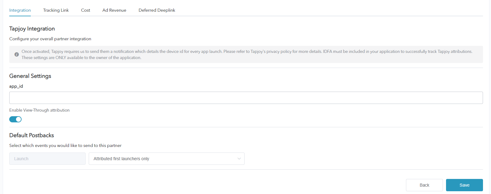
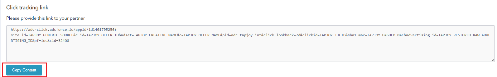
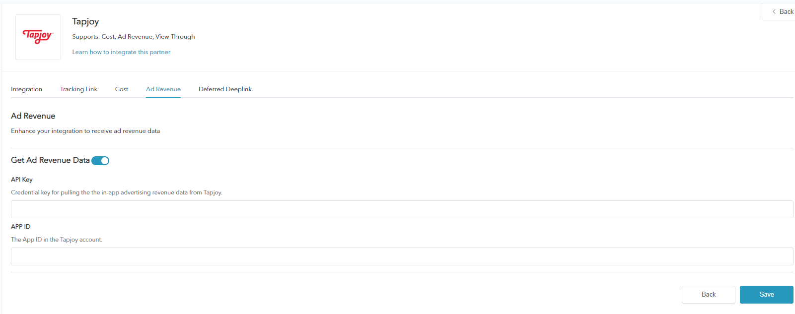

# How to Configure a Campaign with Tapjoy

* Tapjoy, one of Adsforce's integrated partners, providing advertisers with engagement and analytics;

* In addition to click-based performance analysis, IronSource also supports other types of performance analysis such as cost, ad revenue, and view-through.。

## Tapjoy Integration

To configure your campaigns with Tapjoy, follow the steps below.

### Set Up Tapjoy

##### 1. [Login Adsforce](https://demo-portal.adsforce.io/login);

##### 2. Click your App under "My Apps";

##### 3. Under "Configuration" > "Integrated Partner ", search "Tapjoy" and click "EDIT";

##### 4.  Go to Tapjoy's configuration window.

Tapjoy's configuration window includes 5 options: `Integration`, `Tracking Link`, `Cost`, `Ad Revenue` and `Deferred Deeplink`.

### Tapjoy Integration

> **[info] Important**
>
> You can get **Performance Analytics Data** after integration.

#### App ID

* Adsforce is connected to Tapjoy via App ID;
* You can get App ID from Tapjoy.

Refer to the method on getting App ID as below:

######&ensp;&ensp;&ensp;&ensp;1. [Login Tapjoy](<https://ltv.tapjoy.com/s/l#session/login>);
######&ensp;&ensp;&ensp;&ensp;2. Get App ID under **Apps**.

#### Enable View-Through Performance Analytics

Toggle this to **ON** if you want to analyze view-through installs from Tapjoy.

#### Default Postbacks

* Select `Only event attributed to this partner` for events coming **only** from users attributed to Tapjoy;
* Select `Event attributed to any partner or oranganic` to have your **entire** user base available to be reported to Tapjoy.

### Tracking Link

* All parameters added in this page will only generate a **tracking link**;
* This tracking link is only available for Tapjoy;
* You can more in-depth analyze your product using the tracking link.

#### Tracking Link Parameters

* The added parameters will be displayed in the **Tracking link** below;

* You can in-depth analyze your product through adding parameters here;

* Adding and deleting parameters here can redefine the parameters added on the tracking link.

#### Click-Through Performance Analytics

* Configurable click performance analytics lookback window allows you to customize the performance analytics period from **click to app install**;
* Customizable settings 1~23 hours or 1~30 days;
* The time or date set here will appear in the tracking link below.

#### Click Tracking Link

* The link here shows all the setting information;
* The click tracking link will be needed to copy to link to Tapjoy.

######&ensp;&ensp;&ensp;&ensp;1. Click **Copy Content**;

######&ensp;&ensp;&ensp;&ensp;2.  Send the copied link to Tapjoy (you need to ask Tapjoy AM for the click tracking link location).

#### Impression Performance Analytics

* Configurable impression performance analytics lookback window allows you to customize the performance analytics period from **impression to app install**;
* Customizable settings 1~23 hours or 1~30 days;
* The time or date set here will be appeared in the tracking link below.

#### Impression Tracking Link

The link here shows all the setting information;

Copy the impression tracking link to Tapjoy: 

######&ensp;&ensp;&ensp;&ensp;1. Click **Copy Content**;

######&ensp;&ensp;&ensp;&ensp;2. Paste the impression tracking link to Tapjoy (you need to ask Tapjoy AM for the impression tracking link location).

### Cost Configuration

* Your Tapjoy cost data can be enhanced through cost integration;

* Make sure you have got Marketing API Key before enabling Tapjoy cost data.

#### Get Cost Data

To get Tapjoy cost data, you need to turn on **Get Cost Data**.

#### Marketing API key

* Marketing API key is used to verify the API in **Cost Report**;
* The updated data window will take effect until saved.

You can get Marketing API key from Tapjoy Dashboard > **Reporting** > **Marketing API Query Account** page.

### Ad Revenue

* Ad revenue data can be received from Tapjoy through Ad revenue integration;

* Make sure you've got your API Key and App ID before using Ad Revenue.

#### Get Ad Revenue Data

Here you can set performance analysis for Ad revenue data.

To get Tapjoy Ad revenue data, you need to turn on **Get Ad Revenue Data**.

#### API Key

You can get the API Key from Tapjoy Dashboard > **Reporting** > **Legacy APIs** to verify the API in the **Ads Revenue Report**.

> **[warning] Note**
>
> * Insights Reproting API Key: Used to get a single ad;
> * Legacy Reporting API Key: Used to get all ads under the account.

#### Enter App ID

Check and enter App ID in Tapjoy (See “App ID” in this chapter for details).