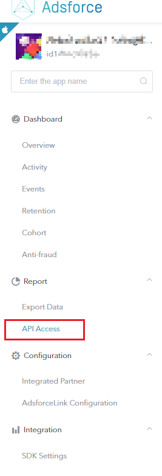
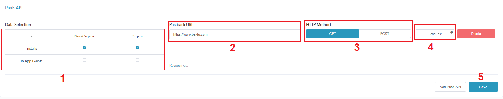
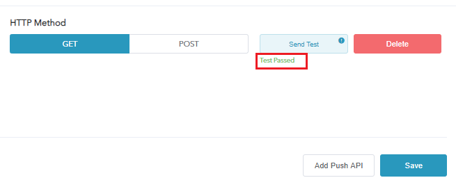
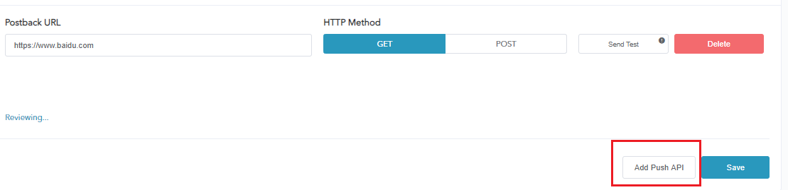

# API Access

Adsforce's CSV data reports are available for manual download through the **Export Data**, and also via the **API Access**.

The reports can either be in aggregated or raw data forms.

## API Access Configuration

To configure API Access, follow the steps below.

### Open API Access Configuration Window

##### 1. [Login Adsforce](https://demo-portal.adsforce.io/login);

##### 2. Click your App under "My Apps";

&ensp;&ensp;

##### 3. Select "Report" > "API Access";

##### 4. Go to API Access configuration window.

API Access configuration window includes 2 options: `Pull API` and `Push API`.

### Pull API

Pull API links are available in **Report** > **API Access** page of each App.

#### **API Key**

- API Key is automatically generated after you add the App;
- Only one API Key can be generated per App.

#### Performance Reports

Select the relevant performance report API.

#### Original Data Reports

Select the relevant raw data report API.

### Push API

##### 1. Optionally choose the mode of Installs and In App Events;

- Organic

- Non-Organic

##### 2. Enter the postback URL;

##### 3. Select HTTP Method

- GET
- POST

##### 4. Click "Send Test" button;

> **[info] Important**
>
> * According to the HTTP code and the content returned from the response body, we confirm the sending status of the data;
> * If the HTTP code is 200 and the value returned from the response body is "ok", the data is sent successfully; Otherwise, it is failed to send the data.

##### 5. When “Test Pass” appears, click “Save”;
> **[warning] Note**
>
> If you click "Delete" after saving, the saved data will be lost.

##### 6. The status of "Reviewing..." indicates that the Adsforce staff has received the notification and is reviewing;

##### 7. If it is approved, the status will be updated to "Enabled";

##### 8. Click the "Add Push API" button to add a postback URL.

> **[warning] Note**
>
> You can add up to 5 passback addresses per App.

## Data Interpretation

### Pull API

| Column Name                                   | Description                                                  |
| --------------------------------------------- | ------------------------------------------------------------ |
| Attributed Touch Type (attr_type)             | Attribution Modes: Click: Click-Through Attribution,  Impression: Impression Attribution |
| Attributed Touch Time (attributed_touch_time) | Attributed Touch Time                                        |
| Attribution Basis (match_type)                | Attribution matching type: id_matching: attribute the device ID, srn: attribute through deeplink in the attribution platform, ua_fing |
| Install Time                                  | Install time                                                 |
| Event Time                                    | Event time                                                   |
| Event Name                                    | Event name                                                   |
| Revenue (revn)                                | Revenue                                                      |
| Event Revenue Currency (revn_curr)            | Event revenue currency                                       |
| Event Revenue USD (revn_usd)                  | Event revenue USD                                            |
| Media Source                                  | Media source that generates the install                      |
| Channel  ID                                   | Channel  ID                                                  |
| Campaign ID                                   | Campaign ID                                                  |
| Campaign                                      | Campaign                                                     |
| Adset ID                                      | Adset ID analyzed from google's referrer and iOS cookie      |
| Adset                                         | Adset name analyzed from google's referrer and iOS cookie    |
| Ad ID                                         | Advertising ID                                               |
| Ad                                            | Advertising name                                             |
| Site ID                                       | Site ID                                                      |
| App ID (appid)                                | App ID                                                       |
| Platform (pf)                                 | Platform                                                     |
| Android ID (aid)                              | Applies to android, android_id                               |
| GAID (gaid)                                   | Applies to android, google advertising id                    |
| Open ID (oid)                                 | openid                                                       |
| IDFA (idfa)                                   | Applies to iOS, idfa                                         |
| IDFV (idfv)                                   | Applies to iOS, idfv                                         |
| Bundle ID (pkg)                               | pkg package name for Android, buddle_id for iOS              |
| OS Version (aon)                              | Android version number                                       |
| API Level (aos)                               | Android api number                                           |
| Equipment Brand (b)                           | brand equipment                                              |
| Equipment Model (m)                           | model equipment                                              |
| Params                                        | Parameters, additional data reported by the user             |
| Pay Verify (pay_verify)                       | Pay verify result                                            |
| Language (lang)                               | Language                                                     |
| Device Language (local)                       | Device language                                              |
| Device Name (name)                            | Device name                                                  |
| App Version Code (pvc)                        | App version code                                             |
| App Version Name (pvn)                        | App version name                                             |
| SDK Version (sdk_ver)                         | SDK version                                                  |
| IP                                            | IP address, the user uses it to send the request             |
| Country ISO (country_iso)                     | Country calculated based on IP address                       |
| City                                          | City calculated based on IP address                          |
| Carrier                                       | Carrier (mobile, telecommunications)                         |
| Time Zone (tz)                                | Time zone                                                    |
| HTTP/User Agent (user_agent)                  | HTTP / User agent                                            |
| Network (n)                                   | Network                                                      |
| Screen Height (h)                             | Screen height                                                |
| Screen Width (w)                              | Screen width                                                 |
| Screen Density (density)                      | Screen density                                               |
| Event Source (event_source)                   | Event source                                                 |

### Push API

#### Event Report

| Column Name                                    | Description                                                  |
| ---------------------------------------------- | ------------------------------------------------------------ |
| Devkey (devkey)                                | Advertiser key                                               |
| App ID (appid)                                 | App ID: pkg package name for google, number for iOS      |
| Platform (pf)                                  | Platform                                                     |
| Android ID (aid)                               | Android device ID                                            |
| GAID (gaid)                                    | Ad ID for Android device                                     |
| Open ID (oid)                                  | SDK ID                                                       |
| IDFA (idfa)                                    | iOS ID (preferred / unique)                                  |
| IDFV (idfv)                                    | Ad ID for iOS device (ID will be changed if uninstalled and installed) |
| Bundle ID (pkg)                                | Bundle ID                                                    |
| OS Version (aon)                               | Android version number                                       |
| API Level (aos)                                | API level                                                    |
| Equipment Brand (b)                            | Equipment brand (Xiaomi, Samsung)                            |
| Equipment Model (m)                            | Equipment model (Apple 7, Xiaomi 6)                          |
| Channel ID (cid)                               | Channel ID                                                   |
| category (cat)                                 | Events category (default is event), only for custom events   |
| Event ID (e_id)                                | Event ID, only for custom events                             |
| Value (val)                                    | Parameter reported by custom event  (event specific values)  |
| Language (lang)                                | Language                                                     |
| Device Language (local)                        | Device language                                              |
| Device Name (name)                             | Device name                                                  |
| App Version Code (pvc)                         | App version code                                             |
| App Version Name (pvn)                         | App version name                                             |
| SDK Version (sdk_ver)                          | SDK version                                                  |
| IP (ip)                                        | IP                                                           |
| Country ISO (country_iso)                      | Country ISO                                                  |
| City                                           | City                                                         |
| Carrier                                        | Carrier (mobile, telecommunications)                         |
| Time Zone (tz)                                 | Time zone                                                    |
| Timezone Abbreviation (tz_abb)                 | Timezone abbreviation                                        |
| User Agent (user_agent)                        | HTTP / User agent                                            |
| Network (n)                                    | Network                                                      |
| Screen Height (h)                              | Screen height                                                |
| Screen Width (w)                               | Screen width                                                 |
| Density                                        | Screen density                                               |
| Client Timestamp (cts)                         | Client timestamp                                             |
| Server Timestamp (sts)                         | The time when the server receives the data                   |
| Attributed Touch Time (attribution_touch_time) | Attributed touch time                                        |
| Install Time                                   | Install time                                                 |
| Media Source                                   | Media source that generates the install                      |
| Campaign ID                                    | Campaign ID                                                  |
| Campaign                                       | Campaign                                                     |
| Adset ID                                       | Adset ID analyzed from google's referrer and iOS cookie      |
| Adset                                          | Adset name analyzed from google's referrer and iOS cookie    |
| Ad ID                                          | Advertising ID                                               |
| Ad                                             | Advertising name                                             |
| UUID                                           | Universally unique identifier                                |
| Customer ID (cuid)                             | Customer custom ID, query from the installation table        |
| Province                                       | Provinces analyzed in nginx log                              |
| Revenue (revn)                                 | Revenue                                                      |
| Event Revenue Currency (revn_curr)             | Event Revenue Currency                                       |
| Params                                         | Parameters, additional data reported by the user             |
| Pay Verify                                     | Pay verify result                                            |
| Receipt ID                                     | Uses for payment verification                                |
| Event Source                                   | Default SDK, event source                                    |

#### Organic Installation Report

| Column Name                                  | Description                                                  |
| -------------------------------------------- | ------------------------------------------------------------ |
| Devkey                                       | Uses to identify a developer identity                        |
| App ID                                       | Identify a App Andriod: pkg package name, iOS: appid     |
| Platform (pf)                                | Platform, including Android and iOS                          |
| Android ID (aid)                             | Android ID                                                   |
| GAID (gaid)                                  | Ad ID for Android device                                     |
| Open ID (oid)                                | SDK ID                                                       |
| IDFA (idfa)                                  | iOS ID (preferred / unique)                                  |
| IDFV (idfv)                                  | Ad ID for iOS device (ID will be changed if uninstalled and installed) |
| Bundle ID (pkg)                              | Bundle ID                                                    |
| OS Version (aon)                             | Android version number                                       |
| API Level (aos)                              | API level                                                    |
| Equipment Brand (b)                          | Equipment brand (Xiaomi, Samsung)                            |
| Equipment Model (m)                          | Equipment model (Apple 7, Xiaomi 6)                          |
| Channel ID (cid)                             | Channel ID                                                   |
| Language (lang)                              | Language                                                     |
| Device Language (local)                      | Device language                                              |
| Device Name (name)                           | Device name                                                  |
| App Version Code (pvc)                       | App version code                                             |
| App Version Name (pvn)                       | App version name                                             |
| SDK Version (sdk_ver)                        | SDK version                                                  |
| Status                                       | User addition or upgrade status                              |
| Google Play Referrer (referrer)              | google's referrer and iOS cookie                             |
| Xh Tracking ID (aq_tranid)                   | Tracking ID generated by click                               |
| Media Source                                 | Media Source analyzed from google's referrer and iOS cookie  |
| Campaign ID                                  | Campaign ID analyzed from google's referrer and iOS cookie   |
| Campaign                                     | Campaign name analyzed from google's referrer and iOS cookie |
| Adset ID                                     | Adset ID analyzed from google's referrer and iOS cookie      |
| Adset                                        | Adset name analyzed from google's referrer and iOS cookie    |
| Ad                                           | Advertising name                                             |
| Site ID                                      | Site ID analyzed from google's referrer and iOS cookie       |
| Click ID                                     | clickid, used to convert network attribution                 |
| IP                                           | IP address, the user uses it to send the request             |
| Country ISO                                  | Country calculated based on IP address                       |
| City                                         | City calculated based on IP address                          |
| Carrier                                      | Carrier (mobile, telecommunications)                         |
| Time Zone                                    | Time zone                                                    |
| HTTP/User Agent                              | User agent                                                   |
| Network (n)                                  | Net user's network type: 0 not connected, 1 wifi, 2 2G, 3 3G, 4 4G, 5 5G |
| Screen Height (h)                            | Screen height                                                |
| Screen Width (w)                             | Screen width                                                 |
| Screen Density (density)                     | Screen density                                               |
| Client timestamp (cts)                       | Client timestamp                                             |
| Server timestamp (sts)                       | The time when the server receives the data                   |
| click lookback                               | Get from Click: The attribution window of the click event    |
| Customer User ID                             | Advertiser’s own user ID                                     |
| Cost model                                   | Cost model                                                   |
| Cost Currency                                | Cost Currency                                                |
| Cost Value                                   | Cost Value                                                   |
| Referrer's Timestamp (ref_click_ts)          | Referrer's timestamp, uses for CTIT anti-fraud               |
| Google Play Download Timestamp (gp_click_ts) | The time when the user clicks the download button for CTIT anti-fraud |
| Attributed Touch Type (attr_type)            | Attribution Modes: click: Click-Through Attribution, impression: Impression Attribution |
| Attribution Basis (match_type)               | Attribution matching type id_matching: device ID attribution, self-attribution platform through deeplink attribution, ua_fing |
| Attributed Touch Time                        | Attributed touch time                                        |
| UUID                                         | Universally unique identifier                                |
| ID                                           | ID                                                           |
| Customer ID                                  | Customer ID                                                  |
| Province                                     | Provinces analyzed in nginx log                              |

