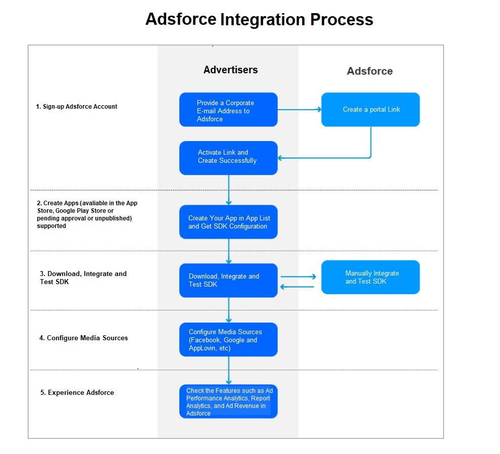

Welcome to Adsforce
===================

Adsforce, specializing in Gaming Vertical, is the market leader in mobile advertising performance analytics, which helps advertisers to pinpoint their targeting, optimize their ad spend and boost ROI.

## Adsforce&ensp;Advantages

* **More Real-time** - Realize the second-level analysis of raw data and present the multi-dimensional report on the Adsforce dashboard through the advanced high-performance real-time big data system;
* **More Cost-effective** - The system can reduce product costs based on running seamlessly on multiple cloud platforms;
* **Much Smarter** - Our team has a wealth of experience in big data processing, machine learning and DevOps to make Adsforce more intelligent.

## What&ensp;is&ensp;Ad&ensp;Performance&ensp;Analytics

The ad performance analytics platform is a way to measure the app installation or post-installation events caused by marketing activities, which plays a key role in optimizing the marketing performance for user acquisition, engagement and retargeting campaigns.

 [Learn More](./advertising-effectiveness/README.md)

## How&ensp;We&ensp;Work

*Learn more about Adsforce? Please check [Get Started](../get-started/README.md).* 

*For SDK, please refer to [SDK Integrations](../sdk-integrations/README.md).*

*View Glossary, click [here](../glossary/README.md).*

