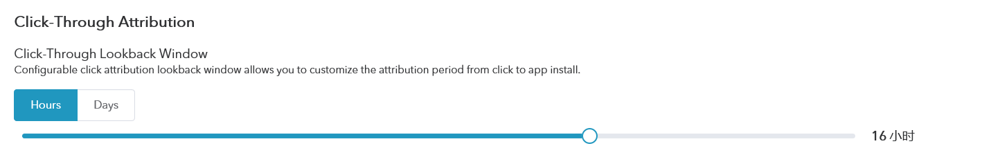
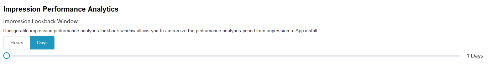

# Ad Performance Analytics Platform

## Overview

The Ad Performance Analytics platform helps advertisers to pinpoint their targeting, optimize their ad spend and boost ROI.

What is Ad Performance Analytics?
---------------------------------

- The Ad Performance Analytics platform is a way to measure the App installation or post-installation events caused by marketing activities, which plays a key role in optimizing the marketing performance for user acquisition, engagement and retargeting campaigns;
- The purpose of marketing Ad Performance Analytics is to evaluate the impact of each ad impression on the final decision taken by mobile users and to help advertisers improve their marketing strategies;
- Through the performance analysis, advertisers can clearly understand the factors that influence user behavior and decision-making, thereby optimizing spending on different channels for user conversions;
- Understanding the conversion capabilities of different channels, including: paid and natural search, mail, advertising, Social media, etc.

## All Participants in Mobile Marketing Ecosystem

- Google Play, iTunes, Facebook and Twitter, etc.;
- Mobile tracking companies.

These participants count installs and events differently based on their own mobile click performance analysis models.

What is a App Installation?
---------------------------

In Adsforce's ad performance analysis model, <b>installation events ate only logged after the user downloads and launches the App.

For the advertising platform, an installation event is only recorded after the App is used; for the App store, an installation event is recorded after being downloaded.

## Ad Performance Analytics Model

Adsforce performance analytics model includes: Click-through and Impression Performance Analytics.

| Click-Through Performance Analytics                          |
| :----------------------------------------------------------- |
| Most App installation events come from user clicks on ads: banners, videos, interstitials etc. Upon the ad click, Adsforce opens a click lookback window with a default duration of 7 days. **Installs that occur during the lookback window duration are considered as non-organic and are attributed to media sources. Installs that occur out of the lookback window are considered as orgsanic installs.**  Adsforce recommends using the 7-day click lookback window, which is the industry standard. However, you can customize the time period to 1-30 days based on the agreement you have with your media sources. For example, Facebook uses a 28-day click-through lookback window, Twitter uses 14 days and Google Ads uses 30 days. You can match Adsforce’s click-through lookback window to any of these values. |

| Impression Performance Analytics                             |
| :----------------------------------------------------------- |
| Impression Ad performance analytics gives marketers visibility into when and where ads are being served through Impression tracking.   |

| **Performance Analytics Model**         | **Performance Analytics Method** | **Clicks Lookback Window** |                           |
| --------------------------------------- | -------------------------------- | -------------------------- | ------------------------- |
|                                         |                                  | **Range**                  | **Recommended (default)** |
| Click-Through (All Integrated Partners) | Referrer, ID Matching            | 1 – 30 Days                | 7 Days                    |
| Click-Through (All Integrated Partners) | Fingerprinting                   | Fixed                      | 1 Day                     |
| Impression（Selected media sources）    | ID Matching                      | 1h-7 Days                  | 1 Day                     |

## Ad Performance Analytics Methods

An Ad Performance Analytics methods are the rule, or set of rules, used to determine how credit for an event is assigned to touchpoints in conversion paths. For example, last touch Ad Performance Analytics assigns 100% credit to the final click immediately prior to sales or conversions.

Adsforce uses a variety of Performance Analytics methods, as following：

| Performance Analytics | Android(google Play) | Android(out of Store) | IOS  |
| --------------------- | -------------------- | --------------------- | ---- |
| Referrer              | √                    | √                     | √    |
| Device ID Matching    | √                    | √                     | √    |
| Fingerprinting        | √                    | √                     | √    |

The click fingerprinting Ad Performance Analytics lookback window is limited to a maximum of 24 hours on iOS and much less on Android to maintain a high level of accuracy.

The method that you choose to use for the Ad Performance Analytics of events depends on the platform and the store (Google Play Store、iOS App Store or Amazon), whether the type of engagement used was click-though, Impression or the conversion type (install or in-app event).

## Advanced Performance Analytics Topics

| Assisted Installs                                            |
| :----------------------------------------------------------- |
| Adsforce fully attributes only one media source per install, usually according to the last ad click or the last ad impression (if there were no clicks).  Assisted Installs (AKA multi-touch Ad Performance Analytics) are installs where the Media-Source/Campaign did not have the last touch, but did touch the user before the install and this took place within their Ad Performance Analytics lookback window. The assisting networks get credit as contributors to the install on Adsforce's dashboard and raw data. |

