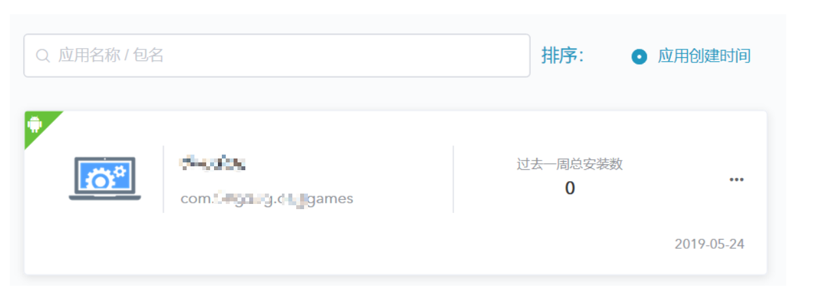
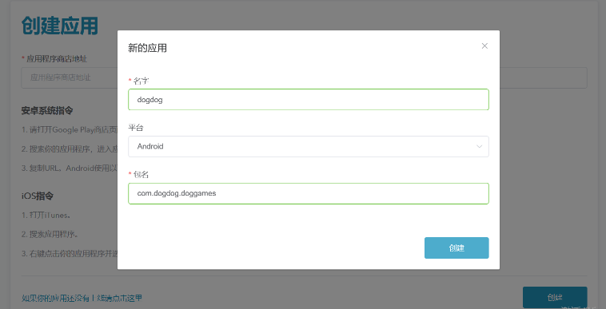

# 创建应用

> **[warning] 注意**
>
> 此功能仅对帐户管理员开放。

###### 1. 在“我的应用”菜单栏项下，点击“添加应用”，开始添加新应用；

###### 2. 进入“应用添加”页面；

###### 3. 点击“创建”，创建应用程序；

###### 4. 可在应用列表中查看添加的应用程序。

可通过以下方式获取应用程序商店链接地址：

###### 1. 安卓系统指令

&ensp;&ensp;1）打开电脑 [Google Play](https://play.google.com/store) 商店页面；

&ensp;&ensp;2）输入并搜索应用程序；

&ensp;&ensp;3）鼠标右键应用程序，选择复制链接。

> **[success] 提示**
>
> 亦可使用安卓手机端创建应用，步骤如下：

&ensp;&ensp;1）下载 Google Play app 后，点击 Play 商店图标；

&ensp;&ensp;2）打开 Google Play 商店页面；

&ensp;&ensp;3）搜索你的应用程序，进入应用程序页面；

&ensp;&ensp;4）复制 URL。

Android 使用以下格式：https://play.google.com/store/apps/details?id={store_id}

###### 2. iOS 指令

&ensp;&ensp;1）打开 iTunes；

&ensp;&ensp;2）搜索应用程序；

&ensp;&ensp;3）右键点击应用程序并选择 Copy 链接。

iOS 使用以下格式：https://itunes.apple.com/{country}/app/{app_name}/id{store_id}

###### 3. 未上线应用
如应用程序未上线（待批准/未发布状态），可通过以下方式进行：

&ensp;&ensp;1）在应用添加页面底部，点击“如果你的应用还没有上线请点击这里”；

&ensp;&ensp;2）在弹出的“新的应用”窗口，输入应用程序名、选择应用发布（ios / Andriod）平台和命名包名；

&ensp;&ensp;3）点击“创建”按钮，确定创建；

&ensp;&ensp;4）可在应用列表中查看添加的应用程序。

