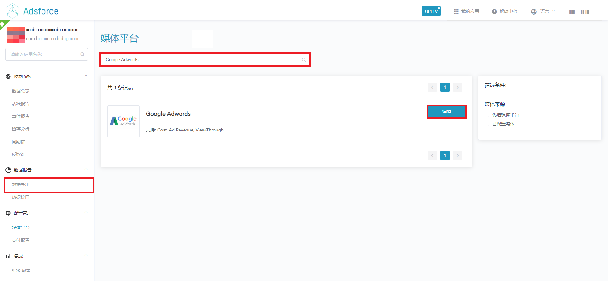
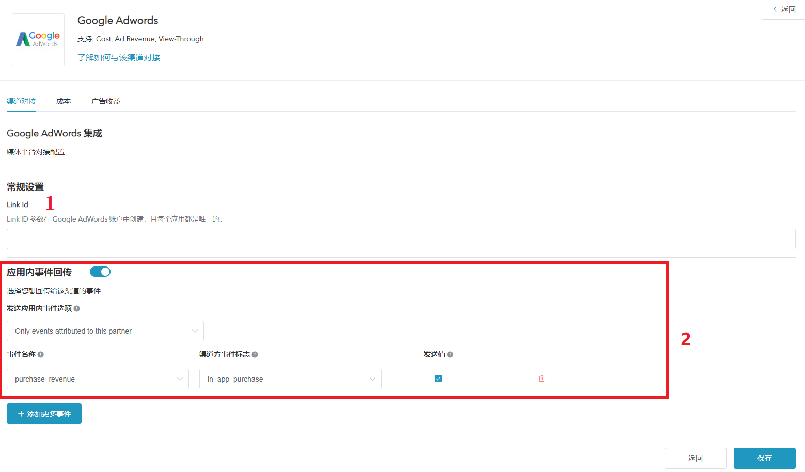

# 介绍

* Adwords是Adsforce的集成合作伙伴之一，为广告提供CPC、CPM和指定站点广告发布服务。
* 除基于点击的移动归因外，Adwords还提供费用，广告收入和浏览归因。
* 如需配置Adwords请按以下步骤操作。
* 打开应用的媒体平台，搜索“Adwords”，单击打开**Adwords**的配置窗口。     

 

* Adwords配置窗口包括3个选项：`渠道对接`、`成本`、`广告收益` 

## 渠道对接

* 渠道对接完成后，便可获取**归因数据**。     

 

### Link Id

* Adsforce是通过Link Id与Adwords连接，Link Id需从Adwords中获取，获取方法如下所示。  

&ensp;&ensp;&ensp;1) 打开<https://ads.google.com/>，点击帐户右上角的工具图标。

&ensp;&ensp;&ensp;2) 在设置**部分，单击**关联的帐户。

&ensp;&ensp;&ensp;3) 在第三方应用分析下，单击“ 详细信息”。

&ensp;&ensp;&ensp;4) 从以下选项中选择创建链接ID：

&ensp;&ensp;&ensp; 如果您从未将任何应用分析提供商与AdWords帐户相关联，请点击创建链接ID。

&ensp;&ensp;&ensp;&ensp;&ensp; 如果您已将应用分析提供商与您的AdWords帐户相关联，并希望创建其他链接，

&ensp;&ensp;&ensp;&ensp;&ensp; 请点击加号按钮以关联新的提供商或应用。

&ensp;&ensp;&ensp;5) 选择其他提供商，关联Adsforce。然后输入Adsforce provider’s ID：6602290452

&ensp;&ensp;&ensp;6) 选择您的移动应用平台（安卓或iOS）。

&ensp;&ensp;&ensp;7) 使用“查找您的应用”字段查找您的应用。

&ensp;&ensp;&ensp;8) 单击“创建链接ID”。如果您在此步骤中看到错误请[联系我们](mailto:contact@upltv.com)。

&ensp;&ensp;&ensp;9) 单击复制按钮以复制链接ID。您将在Adsforce的仪表板中添加它。

&ensp;&ensp;&ensp;10) 单击“完成”。在您将链接ID添加到第三方帐户并且转化数据开始流入AdWords之前，您的状态将显示“未验证”。

### 应用内事件回传

* 您若想回传给Adwords的事件，请将其打开。

* 关于应用内事件的详细信息，可以参考[https://docs.adsforce.io/zh-hans/in-app-events/](https://docs.adsforce.io/zh-hans/in-app-events/)

### 发送应用内事件选项

* 若您想**仅回传**Adwords中的归因数据，请选择`Only events attributed to this partner`

* 若您想**回传所有**合作平台归因数据，请选择`Events attributed to any partner or oranganic`

### 事件设置

* 关于应用内事件，您需要设置事件名称、渠道方事件标志、发送值。
* 您可以在[这里](<https://docs.adsforce.io/zh-hans/in-app-events/>)参考详细信息。

## 成本

* 通过成本对接，可优化您的Adwords推广成本数据。

* 在启用Facebook启用成本数据之前，请确保您已经授权Facebook。

 

### 获取成本数据

* 您若使用来自Adwords成本数据归因，请将其打开。

### 绑定Google

* 点击 `去 Google 授权` 按钮，进入Google授权页面。

* 请使用Google的Business广告账号进行授权。

### 选择广告账户

* 选择广告账户后有助于加速获取成本数据。

* 如果您超过10个广告账户，为了方便您更快速的读取数据，请绑定您对应的App广告账户。

## 广告收益

* 通过广告收益对接，可从Adwords获广告收益数据。

* 在启用Adwords广告收益之前，请确保您已经授权Adwords。

 

### 获取广告收益数据

* 您能在此切换广告收益数据的归因设置。

### 绑定Google

* 如果您需要获取成本数据，请在Adwords授权