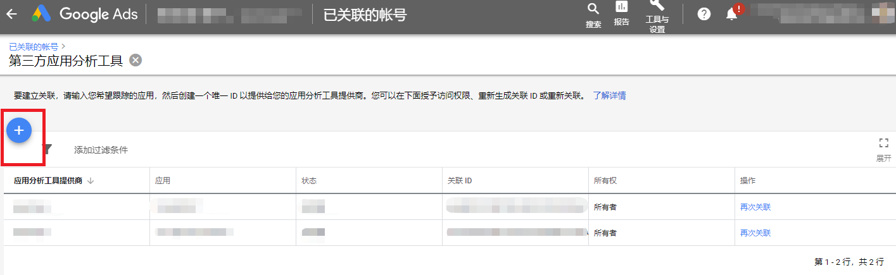

# 链接 ID

Adsforce 是通过链接 ID 与 Adwords 连接，Link ID 需从 Adwords 中获取，获取方法如下所示：

######1. 打开[Google Ads](https://ads.google.com/)，点击帐户右上角的工具图标；

######2. 在设置项目下，单击**“关联的帐户（Linked accounts）”**；

######3. 在第三方应用分析（Third party app analytics）下，单击**“详细信息（DETAILS）”**；

######4. 从以下选项中选择创建 Link ID：

- 如从未将任何应用分析提供商与 AdWords 帐户相关联，请点击**“创建链接 ID（CREATE LINK ID）”**；

   

   

- 如已将应用分析提供商与您的 AdWords 帐户相关联，且需创建其他链接，请点击加号按钮以关联新的提供商或应用。

   

######5. 选择其他提供商，关联 Adsforce。然后输入 Adsforce provider’s ID：66022904；

######6. 选择您的移动应用平台（安卓或 iOS）；

######7. 使用“查找您的应用（LOOK UP YOUR APP）”字段查找您的应用；

######8. 单击“创建链接 ID（CREATE LINK ID）”（如在此步骤中看到错误请[联系我们](mailto:contact@upltv.com)）；

######9. 单击复制按钮以复制链接 ID（用于添加在 Adsforce的仪表板中）；

######10. 单击“完成”。

   > **[success] 提示**
   >
   > 在您将链接 ID 添加到第三方帐户并且转化数据开始流入 AdWords 之前，您的状态将显示“未验证”。

