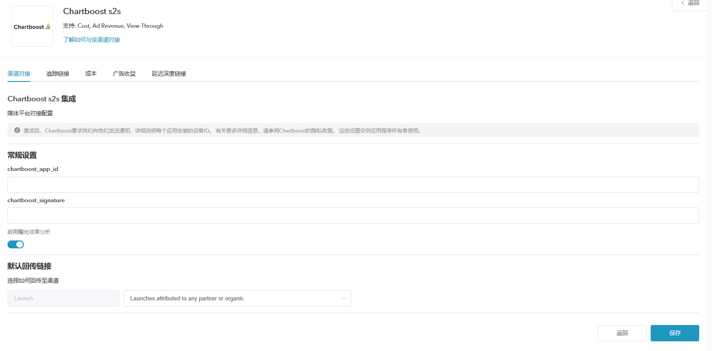
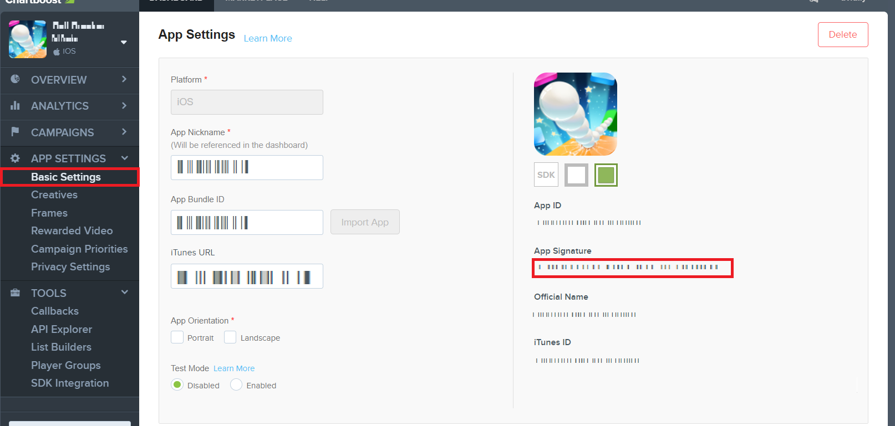
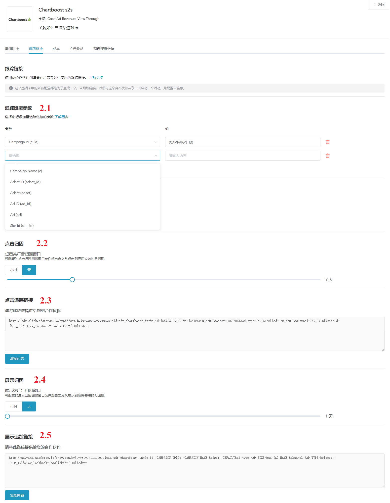
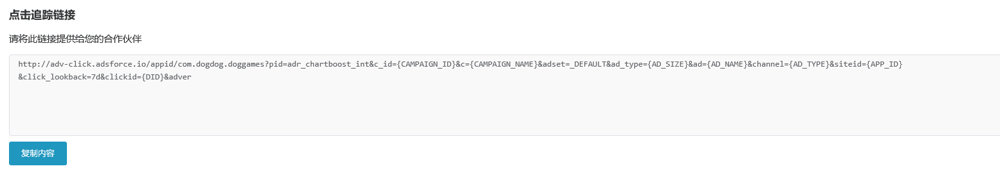

# Chartboost s2s  追踪配置

## 概述

* Chartboost s2s 是 Adsforce 的集成合作伙伴之一，为广告主提供数据分析、广告服务等功能；

* 除基于点击的移动效果分析外，Chartboost s2s 还提供费用、广告收入和浏览效果分析。

  如需配置 Chartboost s2s 请按以下步骤操作：

## Chartboost s2s 追踪配置
### 打开 Chartboost s2s 配置窗口

#####1. [登录 Adsforce 应用](<https://demo-portal.adsforce.io/login>)；

#####2. 在“我的应用”列表项下，单击并选择需配置的应用程序；

#####3. 在“配置管理 > 媒体平台”配置页面，搜索 “Chartboost s2s” 并点击“编辑”；

#####4. 进入 **Chartboost s2s** 配置窗口。 

Chartboost s2s 配置窗口包括5个选项：`渠道对接`、`跟踪链接`、`成本`、`广告收益` 和 `延迟深度链接` 

### 渠道对接

> **[info] 重要信息**
>
> 渠道对接完成后，便可获取**广告效果分析数据**。

#### Chartboost s2s_app_id

* Chartboost s2s_app_id 需从 Chartboost s2s 中获取；

* Adsforce 是通过 Chartboost s2s_app_id 与 Chartboost s2s 连接。  

  Chartboost s2s_app_id 获取方式如下：

#####1. [登录 Chartboost](https://dashboard.chartboost.com/login)；

#####2. 选择 “APP SETTINGS > Basic Settings”;

#####3. 在 “App Settings” 页面，获取 App ID。

#### Chartboost s2s_signature

* Chartboost s2s_signature 需从 Chartboost s2s 中获取；

* Adsforce 是通过 Chartboost s2s_signature 与 Chartboost s2s 连接。 

  Chartboost s2s_app_id 获取方式如下：

#####1. [登录 Chartboost](https://dashboard.chartboost.com/login)；
#####2. 选择 “APP SETTINGS > Basic Settings”;
#####3. 在 “App Settings” 页面，可获取 App Signature。

#### 启用曝光效果分析

如需属性为 Chartboost s2s 的 view-through 安装。请将此选项切换为 **ON**。

#### 默认回传链接

* 如**仅回传 ** Chartboost s2s 中的效果分析数据，请选择`Only event attributed to this partner`

* 如**回传所有**合作平台效果分析数据，请选择`Event attributed to any partner or oranganic`

### 追踪链接

* 在此界面添加的所有参数只会生成一条**追踪链接**；

* 此追踪链接仅适用于 Chartboost s2s；

* 使用追踪链接可更深入的分析研究产品。

#### 跟踪链接参数

* 添加的参数将会**在下方**追踪链接中显示；

* 在此添加参数可深入研究分析产品；

* 此处增删参数都可以重新定义在跟踪链接上已添加的参数。

#### 点击效果分析

* 此滑块允许您自定义设置**点击到安装**的时间；

* 可自定义设置 1~23 小时或 1~30 天；

* 此处设置的时间或日期将会在下方追踪链接中显示。

#### 点击追踪链接

* 此处链接可显示设置的所有信息；
* 需复制点击追踪链接链接至 Chartboost。

#####1. 点击“复制内容”；

#####2. 将复制的链接发送至 Chartboost s2s。

&ensp;&ensp;&ensp;1）[登录Chartboost](https://dashboard.chartboost.com/login)；

&ensp;&ensp;&ensp;2）选择 “APP SETTINGS > Basic Settings”;

&ensp;&ensp;&ensp;3）在 “Advanced Settings” 编辑页面，将复制的“点击追踪链接”粘贴至 “Click Callback”。

#### 展示效果分析

* 此滑块允许自定义设置**展示到安装**的时间；

* 可自定义设置 1~23 小时或 1~30 天；

* 此处设置的时间或日期将会在下方追踪链接中显示。

#### 展示追踪链接

* 此处链接可显示设置的所有信息；
* 此链接可**激活**观看相同类型的广告用户。

#####1. 点击“复制内容”；

#####2. 将复制的链接发送至 Chartboost s2s。

&ensp;&ensp;&ensp;1）[登录Chartboost](https://dashboard.chartboost.com/login)；

&ensp;&ensp;&ensp;2）选择 “APP SETTINGS > Basic Settings”;

&ensp;&ensp;&ensp;3）在 “Advanced Settings” 编辑页面，将复制的“点击追踪链接”粘贴至 “Completed View Callback”。

### 成本

* 通过成本对接，可优化您的 Chartboost s2s 推广成本数据；

* 在启用 Chartboost s2s 成本数据前，请确保已获取 Chartboost s2s 的 API Key。

#### 获取成本数据

如使用的成本数据效果分析来自 Chartboost s2s，则需打开“获取成本数据”。

### 广告收益

* 通过广告收益对接，可从 Chartboost s2s 获广告收益数据。

* 在启用 Chartboost s2s 广告收益之前，请确保您已经获取 UserID 和 App ID。   

#### 获取广告收益数据

此处可切换广告收益数据的效果分析设置。

#### UserID

通过 "Chartboost > TOOlS > API Explorer > Authentication" 获取 UserID，UserID 用于验证**广告收益报表**中的 API。 

#### App ID

通过“Chartboost > APP SETTINGS > Basic Settings”，获取 App ID，以验证**广告收益报表**中的 API。

#### User Signature

通过 "Chartboost > ToolS > API Explorer > Authentication"，查询 **User Signature** 并输入。

