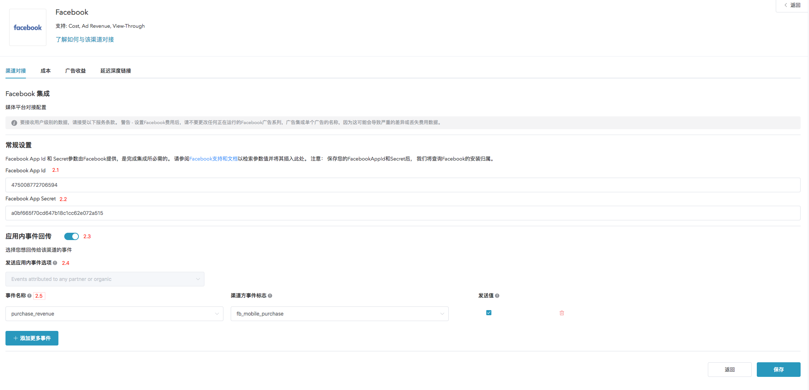
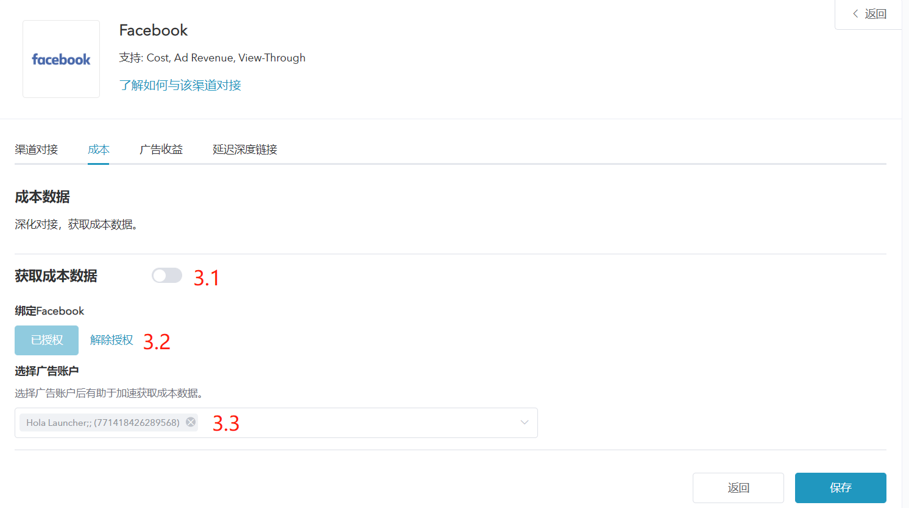
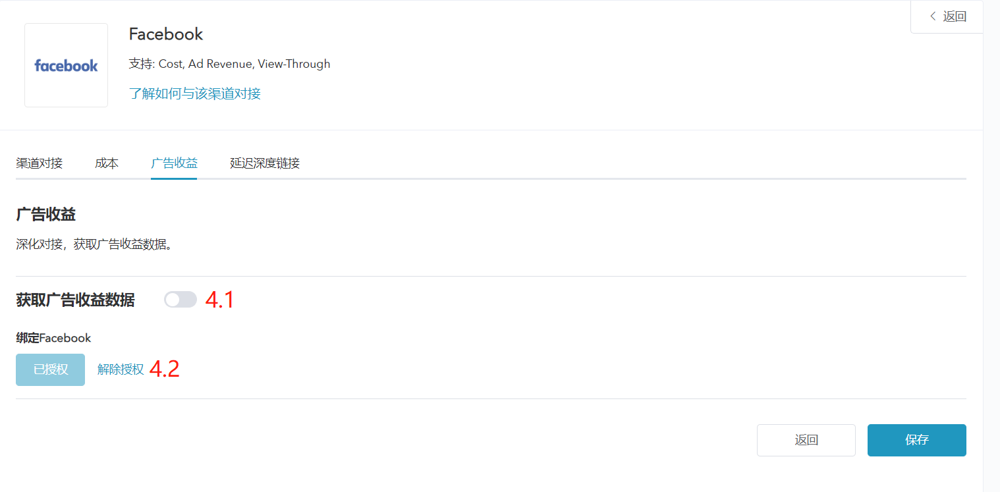
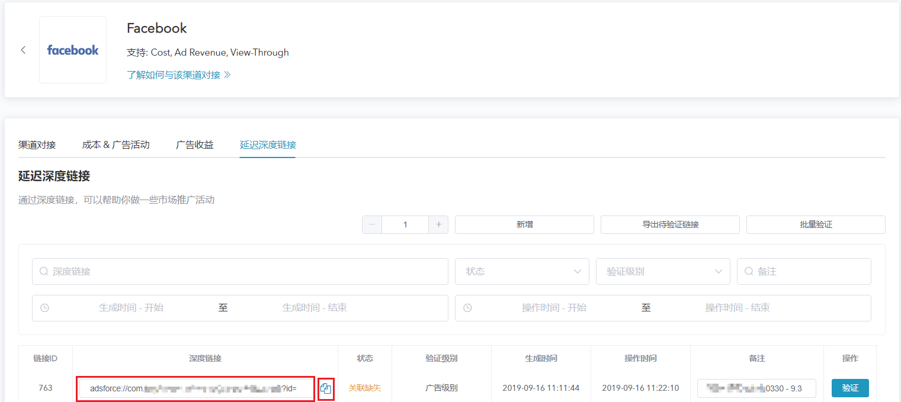
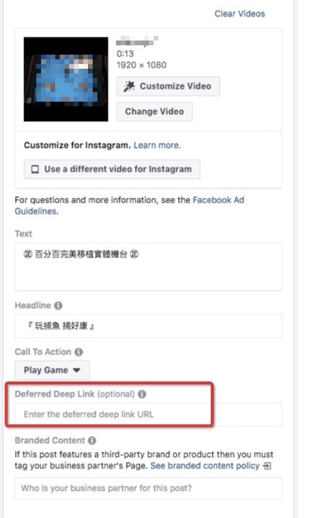
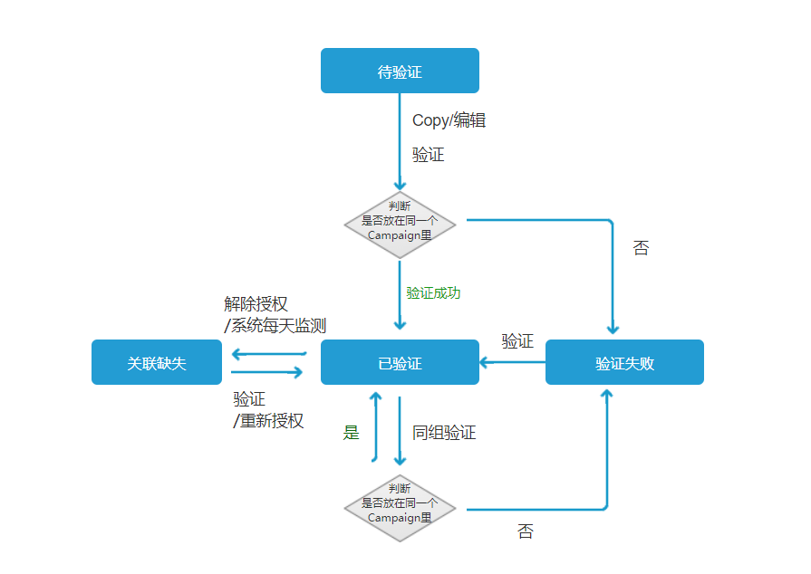

# Facebook 追踪配置

## 概述

* Facebook 是 Adsforce 的集成合作伙伴之一，为广告主提供精确的目标用户和用户习惯；
* 除基于点击的移动效果分析外，Facebook 还提供广告收入和浏览效果分析。

## Facebook 追踪配置

如需配置 Facebook 请按以下步骤操作。

### 打开 **Facebook** 配置窗口

1. [登录 Adsforce 应用](<https://demo-portal.adsforce.io/login>)；

2. 在“我的应用”列表项下，单击并选择需配置的应用程序；

   

3. 在“配置管理 > 媒体平台”配置页面，搜索 “Facebook” 并点击“编辑”；

   

5. 进入 **Facebook** 配置窗口。

 

Facebook 配置窗口包括4个选项：`渠道对接`、`成本`、`广告收益` 和 `延迟深度链接`。

### 渠道对接配置

1. 输入[Facebook App Id 和 Facebook Secret参数](facebook-app-id-facebook-app-secret-configuration/README.md)；
3. 选择并配置 Facebook 应用内事件（如需要）。

 

> **[success] 提示**
>
> **发送应用内时间选项**
> *Facebook 仅支持回传所有合作平台应用内事件。*
>
> * 如**仅回传 ** Facebook 中的应用内事件，请选择`Only event attributed to this partner`
> * 如**回传所有**合作平台应用内事件，请选择`Event attributed to any partner or oranganic`
>
> **事件名称**
> * 第一次启用 Facebook 应用程序内事件时，SDK 中将自动映射到 Facebook 的预定义事件列表；
> * 事件名称，Adsforce 从应用程序中集成的 SDK 或从服务器事件收到的事件名称；
> * 单击“ 添加事件” ，渠道方事件标志将会默认添加；
> * 不选择发送值时，Adsforce 将会把应用内事件所有参数发送给合作伙伴，但收入值除外；
> * 选择发送值时，Adsforce 会发送所有参数，包括收入值；
> * 更新后的数据窗口将于保存后立即生效。

### 成本配置

通过成本对接，可优化您的 Facebook 推广成本数据。
> **[info] 重要信息**
>
> 在启用 Facebook 启用成本数据之前，请确保已授权 Facebook。

 

1. 获取成本数据

   若获取的成本数据源自 Facebook，则需打开“获取成本数据”。

2. 绑定 Facebook

    - 点击“去 Facebook 授权”按钮，进入 Facebook 授权页面；

    - 请使用 Facebook 的 Business 广告账号进行授权（如您超过10个广告账户，为更快捷地读取数据，请绑定对应的 App 广告账户）。
    

### 广告收益

通过广告收益对接，可从 Facebook 获广告收益数据。
> **[info] 重要信息**
>
> 在启用 Facebook 广告收益之前，请确保已授权 Facebook。

 

1. 获取广告收益数据

   若获取的广告收益数据来自 Facebook，则需打开“获取广告收益数据”。

2. 绑定 Facebook

   点击“去 Facebook 授权”按钮，进入 Facebook 授权页面。

### 延迟深度链接

深度链接适用于市场推广活动。
可通过以下三步完成操作：

1. 完成 Facebook 授权；
2. 默认生成一条 Deferred Deeplink；
   
3. 将该条 Deferred Deeplink 复制到您的 Facebook 账号 Ad 的指定位置后，点击“验证”可验证是否关联。
   

> **[success] 提示**
> 
> * 点击“验证”即可帮您验证是否已关联；
> * 状态显示“已验证”，即完成一次配置；
> * 直接拷贝或编辑生成的 Deferred Deeplink 链接后，将该链接拷贝到 Facebook 账号 Ad 的指定位置；
> * 不同的 Campaign 不能共用同一个 Deferred Deeplinks；
> * 链接最多添加10条（编辑按钮可修改链接地址）；
> * 更新后的数据窗口将于保存后即刻生效。

### 验证状态流程图与操作

> **[success] 提示**
> 
> 蓝色按钮为状态图。白色按钮为操作。黑色字体为其他页面及系统操作。
