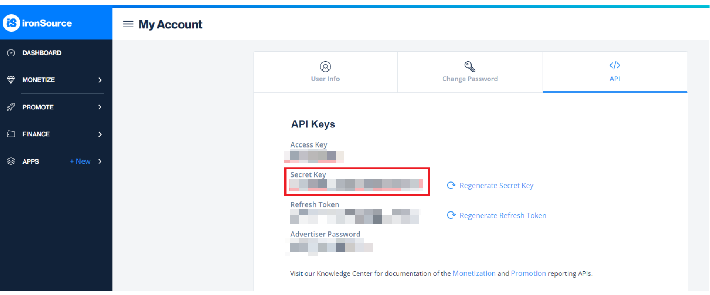

# **IronSource 追踪配置**

## 概述

* IronSource 是 Adsforce 的集成合作伙伴之一，为广告主提供互动、分析等功能；

* 除基于点击的移动效果分析外，IronSource 还提供广告成本、广告收益和曝光效果分析。

## IronSource 追踪配置

如需配置 IronSource 请按以下步骤操作：

### 打开 IronSource 配置窗口

###### 1. [登录 Adsforce 应用](<https://demo-portal.adsforce.io/login>)；

###### 2. 在“我的应用”列表项下，单击并选择需配置的应用程序；

&ensp;&ensp;

###### 3. 在“配置管理 > 媒体平台”配置页面，搜索 “IronSource” 并点击“编辑”；

###### 4. 进入 **IronSource** 配置窗口。

&ensp;&ensp;

IronSource 配置窗口包括5个选项：`渠道对接`、`追踪链接`、`成本`、`广告收益` 和 `延迟深度链接`。

### 渠道对接

> **[info] 重要信息**
>
> 渠道对接完成后，便可获取**广告效果分析数据**。

#### advertiserId

- Adsforce 是通过 advertiserId 和 password 与 IronSource 连接；
- advertiserId 需联系 IronSource 客服索要。

#### password

password 需从 IronSource 中获取。

password 获取步骤如下：

######1. [登录IronSource](https://platform.ironsrc.com/partners/login)；

######2.  选择“My Account”；

&ensp;&ensp;

#####3. 在 “API” 项下，查看并获取 Advertiser Password。

&ensp;&ensp;

#### 启用曝光效果分析

如需属性为 IronSource 的 view-through 安装。请将此选项切换为 **ON**。

#### 默认回传链接

* 如**仅回传**IronSource中的效果分析数据，请选择 “Only event attributed to this partner”；

* 如**回传所有**合作平台效果分析数据，请选择 “Event attributed to any partner or oranganic”。

### 追踪链接

> **[info] 重要信息**
>
> * 在此界面添加的所有参数只会生成一条**追踪链接**；
> * 此追踪链接仅适用于IronSource；
> * 使用追踪链接可对您的产品进行更深入的分析研究。

#### 追踪链接参数

* 添加的参数将会**在下方**追踪连接中显示；

* 在此添加参数可深入研究分析；

* 此处增删参数均可重新定义在跟踪链接上已添加的参数。

#### 点击效果分析

* 此滑块允许自定义设置**点击到安装**的时间；

* 可自定义设置 1~23 小时或 1~30 天 ；

* 此处设置的时间或日期将会在下方追踪链接中显示。

#### 点击追踪链接

* 此处链接显示了您设置的所有信息；

* 需复制点击追踪链接链接至 IronSource。

######&ensp;&ensp;&ensp;&ensp;1. 点击“复制内容”；

######&ensp;&ensp;&ensp;&ensp;2. 将复制的链接发送至 IronSource。

&ensp;&ensp;&ensp;&ensp;&ensp;&ensp;1）[登录 IronSource](https://platform.ironsrc.com/partners/login)；

&ensp;&ensp;&ensp;&ensp;&ensp;&ensp;2）在“PROMOTE”项目下，选择 Campaigns；

&ensp;&ensp;&ensp;&ensp;&ensp;&ensp;3）在 Campaigns 编辑页面，将复制的“点击追踪链接”粘贴至 “Click URL”。

#### 展示效果分析

* 此滑块允许自定义设置**展示到安装**的时间；

* 可自定义设置 1~23 小时或 1~30 天 ；

* 此处设置的时间或日期将会在下方追踪链接中显示。

#### 展示追踪链接

* 此处链接可显示设置的所有信息；

* 此链接可**激活**观看相同类型的广告用户。

######&ensp;&ensp;&ensp;&ensp;1. 点击“复制内容”；

######&ensp;&ensp;&ensp;&ensp;2. 将复制的链接发送到IronSource。

&ensp;&ensp;&ensp;&ensp;&ensp;&ensp;1）[登录 IronSource](https://platform.ironsrc.com/partners/login)；

&ensp;&ensp;&ensp;&ensp;&ensp;&ensp;2）在“PROMOTE”项目下，选择 Campaigns；

&ensp;&ensp;&ensp;&ensp;&ensp;&ensp;3）在 Campaigns 编辑页面，将复制的“点击追踪链接”粘贴至 “Impression URL”。

  

### 成本

> **[info] 重要信息**
>
> * 通过成本对接，可优化您的 IronSource 推广成本数据；
> * 在启用 IronSource 启用成本数据前，请确保已开启获取成本数据。

#### 获取成本数据

如需获取 IronSource 类成本数据，则需打开“获取成本数据”开关。

### 广告收益

> **[info] 重要信息**
>
> * 通过广告收益对接，可从 IronSource 获取广告收益数据；
> * 在启用 IronSource 广告收益之前，请确保已获取 User Name 和应用 ID。

#### 获取广告收益数据

此处可切换广告收益数据的效果分析设置。

如需获取 IronSource 类广告收益数据，则需打开“获取广告收益数据”开关。

#### User Name

* 通过查询账户页面获取 User Name 以便验证**广告收益报表**中的 API；

* 创建应用之后 IronSource 会自动赋予 User Name。

  

#### 应用 ID

通过“APPS > APP Mamagement”，可在 “Application Management” 页面查询获取应用 ID 以验证**广告收益报表**中的API 。

#### Secret Key

* 查询在 IronSource 应用程序的 **Secret Key** 并输入；

* Secret Key 需要向 IronSource 客服索要。

