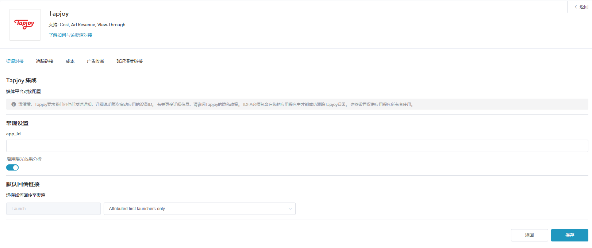
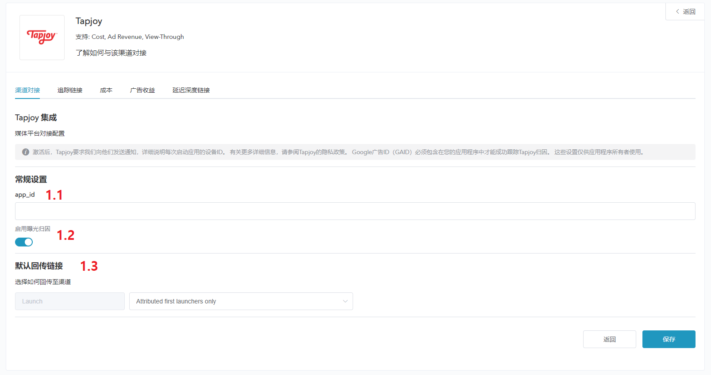
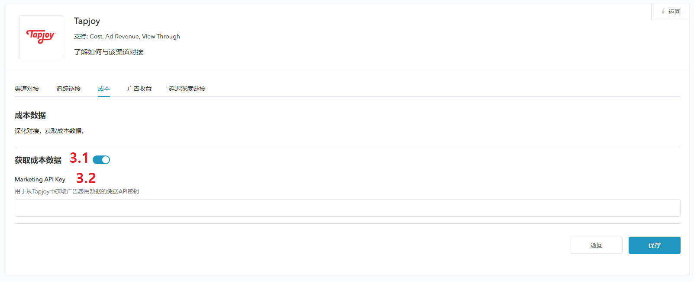
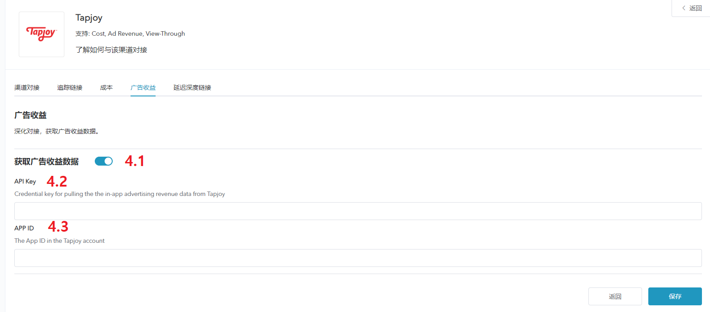

# **Tapjoy 追踪配置**

## 概述

* Tapjoy 是 Adsforce 的集成合作伙伴之一，为广告主提供广告服务、分析等功能；

* 除基于点击的移动效果分析外，Tapjoy 还提供费用、广告收入和浏览效果分析；

## Tapjoy 追踪配置

如需配置 Tapjoy 请按以下步骤操作：

### 打开 Tapjoy 配置窗口

#####1. [登录 Adsforce 应用](<https://demo-portal.adsforce.io/login>)；

#####2. 在“我的应用”列表项下，单击并选择需配置的应用程序；

#####3. 在“配置管理” > “媒体平台”配置页面，搜索 “Tapjoy” 并点击“编辑”；

#####4.  进入 Tapjoy 配置窗口。

Tapjoy 配置窗口包括5个选项：`渠道对接`、`追踪链接`、`成本`、`广告收益` 和 `延迟深度链接`

### 渠道对接

> **[info] 重要信息**
>
> 渠道对接完成后，便可获取**广告效果分析数据**。

#### app_id

* Adsforce 是通过 app_id 与 Tapjoy 连接；
* [app_id](app-id/README.md) 需从 Tapjoy 中获取。

#### 启用曝光效果分析

如需属性为 Tapjoy 的 view-through 安装。请将此选项切换为 **ON**。

#### 默认回传链接

* 如**仅回传 ** Tapjoy 中的效果分析数据，请选择`Only event attributed to this partner`

* 如**回传所有**合作平台效果分析数据，请选择`Event attributed to any partner or oranganic`

### 追踪链接

* 在此界面添加的所有参数只会生成一条**追踪链接**；

* 此追踪链接仅适用于 Tapjoy；

* 使用追踪链接可更深入的分析研究产品。

#### 追踪链接参数

* 添加的参数将会**在下方**追踪连接中显示；

* 在此添加参数可深入研究分析产品；

* 此处增删参数均可重新定义在跟踪链接上已添加的参数。

#### 点击效果分析

* 此滑块允许自定义设置**点击到安装**的时间；

* 您可以自定义设置 1~23 小时或 1~30 天；

* 此处设置的时间或日期将会在下方追踪链接中显示。

#### 点击追踪链接

* 此处链接可显示设置的所有信息。

* 需复制点击追踪链接链接至 Tapjoy。

#####1. 点击“复制内容”；

#####2.  将复制的链接发送至 Tapjoy（粘贴追踪链接位置需向Tapjoy AM索要）。

#### 展示效果分析

* 此滑块允许自定义设置**展示到安装**的时间；

* 可自定义设置 1~23 小时或 1~30 天；

* 此处设置的时间或日期将会在下方追踪链接中显示。

#### 展示追踪链接

* 此处链接可显示设置的所有信息；

* 需复制展示追踪链接至 Tapjoy。 

#####1. 点击“复制内容”；

#####2. 将复制的链接发送至 Tapjoy（粘贴追踪链接位置需向Tapjoy AM索要）。      

### 成本

* 通过成本对接，可优化您的 Tapjoy 推广成本数据；

* 在启用 Tapjoy 启用成本数据之前，请确保已获取 Marketing Key。

#### 获取成本数据

如使用的成本数据效果分析来自 Tapjoy，则需打开“获取成本数据”。

#### Marketing API key

* 广告主用于验证**成本报表**中的 API；

* 更新后的数据窗口将于保存后即刻生效。

### 广告收益

* 通过广告收益对接，可从 Tapjoy 获广告收益数据。

* 在启用 Tapjoy 广告收益之前，请确保已获取 API Key 和 APP ID。

#### 获取广告收益数据

此处可切换广告收益数据的效果分析设置。

#### API Key

通过“`Tapjoy` > `Reporting` > `Legacy APIs`”查询账户页面获取 API Key 以便验证**广告收益报表**中的 API。

#### APP ID

查询在Tapjoy应用程序的 [**app_id**](app-id/README.md) 并输入。