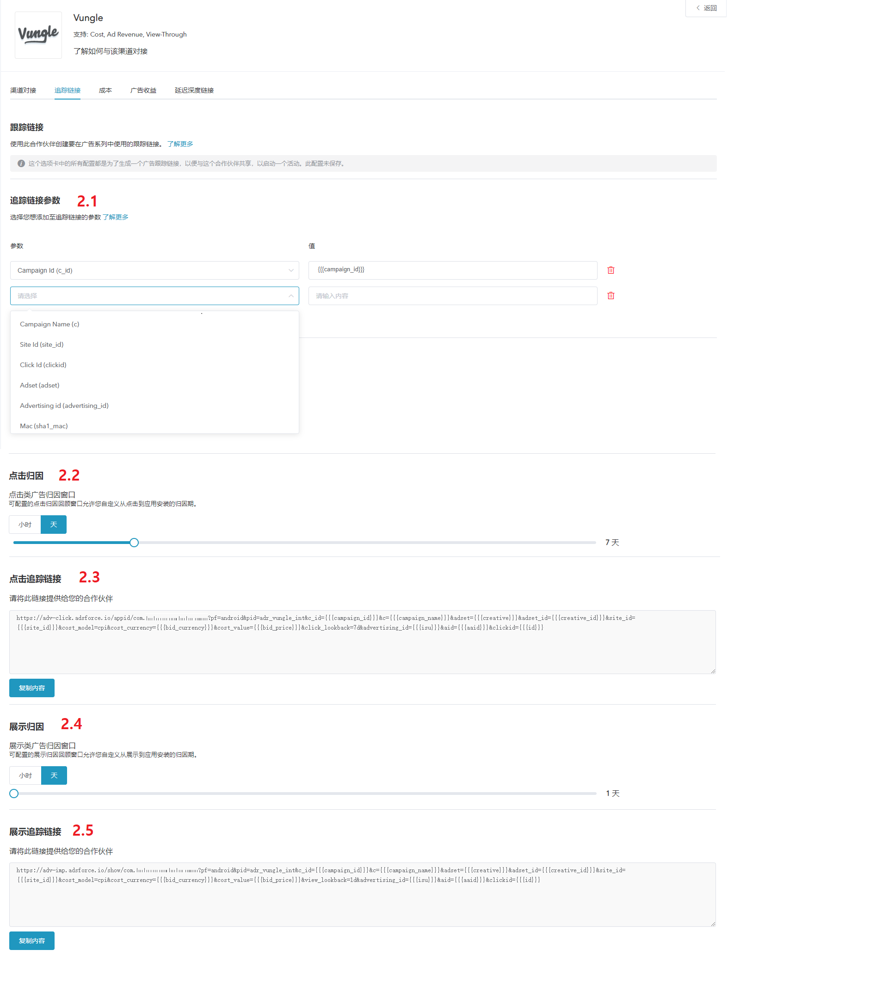
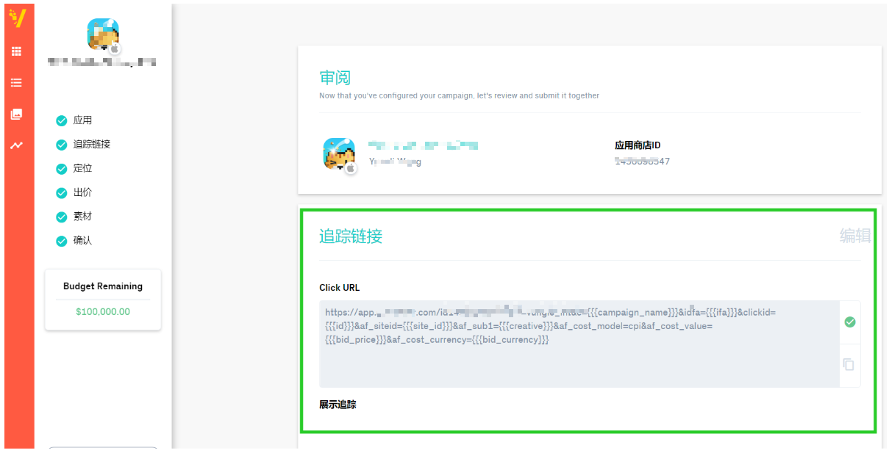

# 介绍

* Vungle是Adsforce的集成合作伙伴之一，为广告主提供面向营销人员的视频广告。

* 除基于点击的移动归因外，Vungle还提供费用，广告收入和浏览归因。

* 如需配置Vungle请按以下步骤操作。

* 打开应用的媒体平台，搜索“Vungle”，单击打开**Vungle**的配置窗口。     

 

* Vungle配置窗口包括5个选项：`渠道对接`、`跟踪链接`、`成本`、`广告收益` 和 `延迟深度链接`      

## 渠道对接

* 渠道对接完成后，便可获取**归因数据**。          

      

### app_id

* Adsforce是通过app_id与Vungle连接，app_id需从Vungle中获取。  

### 启用曝光归因

* 您若使用来自Vungle曝光归因，请将其打开。

### 默认回传链接

* 若您想**仅回传**Vungle中的归因数据，请选择`Only event attributed to this partner`

* 若您想**回传所有**合作平台归因数据，请选择`Event attributed to any partner or oranganic`

## **追踪链接**

* 在此界面添加的所有参数只会生成一条**追踪链接**。

* 此追踪连接仅适用于Vungle。

* 使用追踪连接可以对您的产品进行更深入的分析研究。

 

### 跟踪链接参数

* 添加的参数将会**在下方**追踪连接中显示。

* 在此添加参数可以使您对此进行深入研究分析。

* 此处增删参数都可以重新定义在跟踪链接上已添加的参数。

### 点击归因

* 此滑块允许您自定义设置**点击到安装**的时间。

* 您可以自定义设置 1~23 小时或 1~30 天 。

* 此处设置的时间或日期将会在下方追踪链接中显示。

### 点击追踪链接

* 此处链接显示了您设置的所有信息。

* 复制此链接发送到Vungle，可以**引导**您的潜在客户进行点击广告。

### 展示归因

* 此滑块允许您自定义设置**展示到安装**的时间。

* 您可以自定义设置 1~23 小时或 1~30 天 。

* 此处设置的时间或日期将会在下方追踪链接中显示。

### 展示追踪链接

* 通过成本对接，可优化您的Vungle推广成本数据。

* 在启用Adcolony成本数据之前，请确保您已经获取Adcolony API Key。

* 此处链接显示了你设置的所有信息。

* 复制此链接发送到Vungle，以便**激活**观看相同类型的广告用户。

  

## **成本**

* 通过成本对接，可优化您的Vungle推广成本数据。

* 在启用Vungle启用成本数据之前，请确保您已经获取API Key。 

 

### 获取成本数据

* 您若使用来自Vungle成本数据归因，请将其打开。

### API KEY

* 广告主用于验证**成本报表**中的API。 

* 更新后的数据窗口将于保存后立即生效。

## **广告收益**

* 通过广告收益对接，可从Vungle获广告收益数据。

* 在启用Vungle广告收益之前，请确保您已经获取Secret Key Key和App ID。

 

### 获取广告收益数据

* 您能在此切换广告收益数据的归因设置。

### Secret Key

* 通过查询账户页面中的Key来获取Secret Key以便验证**广告收益报表**中的API 。

* Secret Key需要向Vungle索要。

### App ID

* 查询在Vungle应用程序的**App ID**并输入。

