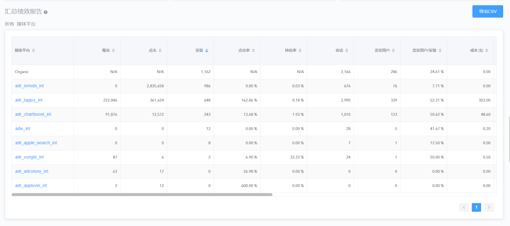

# 汇总绩效报告

报表包含以下信息：

| 名称                         | 描述                           |
| ---------------------------- | ------------------------------ |
| 媒体源                       | 引起安装事件的所有渠道         |
| 国家                         | 安装 ip 所在国家               |
| 日期                         | 所选时间段中的每个日期         |
| 广告活动                     | 活动名称                       |
| 曝光                         | 曝光数                         |
| 点击                         | 点击数                         |
| 安装                         | 安装数                         |
| 转化率                       | 总安装数/ 点击数               |
| 访问                         | App 打开次数                   |
| 忠实用户                     | 默认 - 打开 app 超过3次的用户  |
| 忠实用户数/安装数            | 忠实用户占非有机安装数的比例   |
| 总收益                       | 从各渠道和广告活动中获取的收益 |
| 成本                         | 总成本                         |
| ROI                          | 投资回报率                     |
| ARPU                         | 每用户平均收入                 |
| eCPI                         | 每次有效安装成本               |
| 事件:(独立用户)              | 发起事件的独立用户数           |
| 事件:{事件名称} (事件计数器) | 事件计数器                     |
| 事件:{事件名称} (收益)       | 事件收益额（USD）              |
| 事件:{事件名称} (事件/安装)  | 事件数 / 安装数                |
| 事件:{事件名称} (eCPA)       | 总成本/ 事件数                 |

CSV 报表可在 Adsforce Dashboard 中查看

[table.xlsx](table.xlsx)

