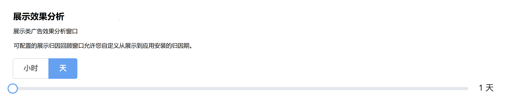

# 广告效果分析平台

## 概述

广告效果分析平台可帮助营销人员确定目标、优化广告支出并提高投资回报率。

## **什么是效果分析?**

- 移动效果分析是用来衡量由于市场营销活动而导致的应用安装或安装后事件的一种方式，对用户获取、用户参与度的提升和用户回归起到十分关键的作用；
- 营销效果分析的目的是评估每个广告展示对移动用户最终采取决策的影响力，有助于营销人员改善营销策略；
- 通过效果分析，营销者可以清晰地了解影响用户行为和决策的因素，从而优化为了用户转化而在不同渠道上的支出；了解不同渠道的转化能力，包括：付费搜索、自然搜索、邮件、广告、社交媒体等。

## 移动营销生态系统中的所有参与者

- Google Play 和 iTunes 到 Facebook、Twitter 等广告平台；
- 移动追踪公司。

此类参与者都有自己的移动点击效果分析类型，因此它们对安装等事件有着不同的统计方式。

## 安装事件统计方式

在 Adsforce 的广告效果分析类型中，<b>安装事件只有在用户下载并启动 App 后才会被记录。</b>

而对于广告平台，用户只有在使用 app 后才记作一次安装事件；对于应用商店，下载后便记作一次安装事件。 

## **广告效果分析方法**

Adsforce 效果分析方法为：“点击” 效果分析 和 “展示” 效果分析。

| 点击效果分析                                                 |
| :----------------------------------------------------------- |
| 大多数应用安装事件是因用户点击各种广告引起的，包括横幅、激励视频和插屏等等。在广告上点击 Adsforce 会打开一个广告效果分析回溯窗口，系统默认回溯期为7天。<b>在该回溯期中发生的安装事件为 Adsforce 追踪到的有效激活用户的事件，并将其点击效果分析为各个媒体源；对于其它的安装，则被认为是有机安装。</b>  Adsforce 推荐采用系统默认的7天广告效果分析回溯期，这也是业界标准。然而，您同样可根据不同渠道的规定来设置1-30天的广告效果分析回溯期。例如，Facebook 采用的是28天的回溯期；Twitter 是14天；Google Ads 是30天等。您可以相应地调整回溯期天数。  |

| 展示效果分析                                                 |
| :----------------------------------------------------------- |
| 展示效果分析是指通过参考广告的浏览人数以及之后 App 的下载量来进行测量广告效果的一种衡量形式。   |

## 广告效果分析类型

广告效果分析类型是 Adsforce 用来确定产生的用户转化来自于哪个媒体源的规则。例如，最后点击效果分析类型将用户转化全部归功于用户最后点击的媒体源。

| **效果分析类型**             | **效果分析方法**    <td colspan=3>       <td colspan=2> **效果分析回溯窗口**                |
| ---------------------------- | ---------------- | ----------------- | ----------------- | ---- | -------------------- | --------------- |
|                              |                  | 安卓(Google Play) | 安卓 (非应用商店) | iOS  | **范围**             | **推荐 (默认)** |
| 点击效果分析（所有媒体源）   | 推荐人、ID匹配   | √                 | √                 | √    | 1 – 30 天            | 7 天            |
| 点击效果分析（所有媒体源）   | 指纹识别         | √                 | √                 | √    | 固定                 | 1 天            |
| 展示效果分析（选定的媒体源） | ID匹配           | √                 | √                 | √    | 1小时-7天            | 1 天            |

为了保证点击效果分析结果的精准度，对于 iOS，指纹识别点击效果分析的回溯期最大为 24h；而对于安卓，其回溯期则需设置的更短。

不论点击效果分析类型是点击点击效果分析还是展示点击效果分析，不论转化类型是安装还是应用内事件，其点击效果分析方法的选择都取决于发行渠道和应用商店（Google Play Store、iOS App Store 和亚马逊等）。

## 高级点击效果分析话题

| 辅助安装                                                     |
| :----------------------------------------------------------- |
| Adsforce 点击效果分析模型将每一次安装归功于最后点击或最后展示的媒体源（无点击情况下）。  辅助安装（即多点点击效果分析模型）：虽然安装不是通过某些渠道以最后点击或最后展示的方式促成的，但这些渠道确实在回溯期内接触到了安装用户，因此，这在 Adsforce 点击效果分析模型中被称为辅助安装，而且 Adsforce dashboard 和原数据会记录这些渠道的贡献。  |

